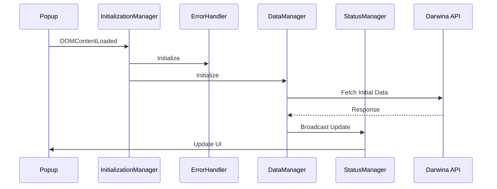
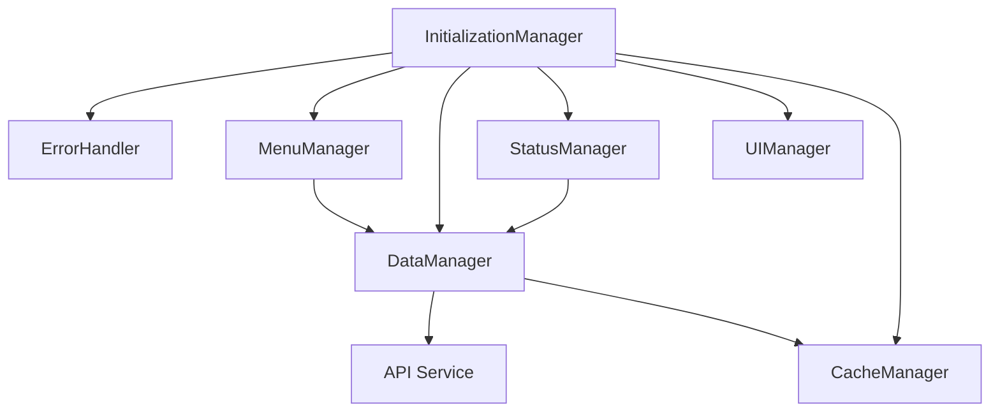

# API Changes Documentation

## Current Issues
1. Multiple components making redundant API calls
2. Inconsistent cache management
3. No clear distinction between initial load and delta updates
4. Overlapping responsibilities between managers
5. Inconsistent data flow

## Required Changes Overview

### 1. Initialization Flow


### 2. Manager Dependencies


### 3. Initialization Order
1. ErrorHandler (🚀 0ms)
2. MenuManager (📌 2ms)
3. InitialLoadingManager (⏳ 0.7ms)
4. EventManager (✅ 0.1ms)
5. AlarmManager (🔄 0.1ms)
6. ConnectionManager (🔧 0.1ms)
7. CacheManager (💾 10.2ms)
8. UIManager (🎨 6.5ms)
9. ThemeManager (🎨 9.0ms)
10. DebugManager (🔧 3.2ms)
11. VolumeManager (🔊 2.0ms)
12. StoreManager (🏪 5.5ms)
13. MenuManager (📋 3.7ms)
14. LanguageManager (🌍 18.5ms)
15. InterfaceManager (🖥️ 16.1ms)
16. DataManager (📊 20.5ms)
17. StatusManager (✨ 11.8ms)
18. UserManager (👤 0.9ms)
19. NotificationManager (🔔 0.6ms)
20. UpdateManager (🔄 1.0ms)
21. RefreshManager (♻️ 1.0ms)
22. RankingManager (📊 0.0ms)
23. SettingsManager (⚙️ 4.2ms)
24. MessageManager (📨 2.2ms)

### 4. Component Responsibilities

#### Background.js (Single Source of Truth)
- Primary API communication
- Cache management
- Data distribution
- State management

```javascript
class OrderManager {
    #lastUpdateTimestamp = null;
    #orderCache = new Map();
    #currentStore = 'ALL';
    
    async initialize() {
        const lastUpdate = await chrome.storage.local.get('lastUpdateTimestamp');
        this.#lastUpdateTimestamp = lastUpdate?.lastUpdateTimestamp;
        
        if (!this.#lastUpdateTimestamp) {
            await this.refreshData();
        } else {
            await this.fetchDeltaUpdates();
        }
    }

    async fetchAllOrders(store = 'ALL') {
        const orderService = await getOrderService();
        const orders = await orderService.fetchOrders(store);
        this.#updateCache(orders);
        return orders;
    }

    async fetchDeltaUpdates() {
        if (!this.#lastUpdateTimestamp) return [];
        
        const orderService = await getOrderService();
        const modifiedOrders = await orderService.fetchOrders(this.#currentStore, {
            modified_from: new Date(this.#lastUpdateTimestamp).toISOString()
        });
        
        this.#updateCache(modifiedOrders);
        return modifiedOrders;
    }

    #updateCache(orders) {
        orders.forEach(order => {
            this.#orderCache.set(order.id, order);
        });
        this.#lastUpdateTimestamp = Date.now();
        this.#saveState();
    }

    async #saveState() {
        await chrome.storage.local.set({
            lastUpdateTimestamp: this.#lastUpdateTimestamp,
            currentStore: this.#currentStore
        });
    }

    async refreshData() {
        this.#orderCache.clear();
        const orders = await this.fetchAllOrders(this.#currentStore);
        await this.broadcastUpdate(orders);
    }

    async handleStoreChange(newStore) {
        this.#currentStore = newStore;
        await this.#saveState();
        await this.fetchDeltaUpdates();
    }

    async broadcastUpdate(orders) {
        messageManager.broadcast({
            type: 'ORDERS_UPDATED',
            payload: {
                orders,
                timestamp: Date.now(),
                store: this.#currentStore
            }
        });
    }
}
```

#### DataManager.js (Data Processing)
- Order data processing
- Cache management
- Event emission for updates

```javascript
export class DataManager extends BaseManager {
    async initialize() {
        await this.#loadInitialData();
        this.#setupEventListeners();
    }

    async #loadInitialData() {
        const data = await this.fetchFullData();
        await this.updateCache(data);
        await this.processOrderCounts(data);
    }

    async processOrderCounts(orders) {
        const counts = this.calculateOrderCounts(orders);
        await this.broadcastCountUpdate(counts);
    }

    #setupEventListeners() {
        eventManager.subscribe('data:refresh', this.refreshData.bind(this));
        eventManager.subscribe('store:change', this.handleStoreChange.bind(this));
    }
}
```

#### StatusManager.js (UI Updates)
- UI status updates
- Service health monitoring
- Event handling for UI updates

```javascript
export class StatusManager extends BaseManager {
    #setupEventListeners() {
        eventManager.subscribe('ui:ready', this.handleUIReady.bind(this));
        eventManager.subscribe('service:status', this.handleServiceStatus.bind(this));
        eventManager.subscribe('store:change', this.handleStoreChange.bind(this));
    }

    async updateOrderCounts(counts) {
        await this.#updateUI(counts);
        eventManager.emit('counts:updated', {
            counts,
            timestamp: Date.now()
        });
    }
}
```

### 5. Event Flow
1. Initial Load Events:
   - `loading:start`
   - `loading:progress`
   - `ui:ready`
   - `theme:applied`
   - `menu:ready`
   - `language:changed`
   - `orders:counts-updated`
   - `loading:finish`

2. Data Update Events:
   - `data:refresh`
   - `orders:counts-updated`
   - `menu:dataUpdated`

3. Store Change Events:
   - `menu:storeChanged`
   - `store:change`
   - `orders:counts-updated`

### 6. Implementation Steps

1. Phase 1: Core Infrastructure
   - Implement OrderManager in background.js
   - Update DataManager to use OrderManager
   - Implement proper event system

2. Phase 2: Data Flow
   - Implement cache management
   - Add delta updates
   - Update UI components

3. Phase 3: Integration
   - Connect managers
   - Add error handling
   - Implement logging

4. Phase 4: Testing
   - Test all scenarios
   - Verify performance
   - Check error handling

### 7. Success Metrics

1. Performance Metrics:
   - Initialization time < 2000ms
   - API response time < 500ms
   - UI update time < 100ms

2. Reliability Metrics:
   - Error rate < 1%
   - Cache hit rate > 80%
   - Zero duplicate API calls

3. User Experience Metrics:
   - UI response time < 50ms
   - Data consistency 100%
   - Zero UI freezes

### 8. Monitoring

1. Performance Monitoring:
   ```javascript
   class PerformanceMonitor {
       static logTiming(operation, duration) {
           console.log(`${new Date().toISOString()} [Performance] ${operation}: ${duration}ms`);
       }
   }
   ```

2. Error Monitoring:
   ```javascript
   class ErrorMonitor {
       static logError(component, error) {
           console.error(`${new Date().toISOString()} [Error] ${component}: ${error.message}`);
       }
   }
   ```

3. API Monitoring:
   ```javascript
   class APIMonitor {
       static logRequest(endpoint, duration, status) {
           console.log(`${new Date().toISOString()} [API] ${endpoint}: ${duration}ms, Status: ${status}`);
       }
   }
   ``` 