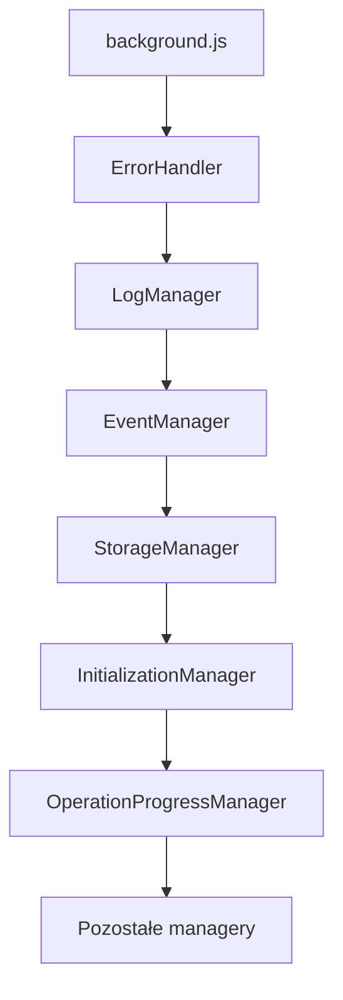

# 🧹 Cleanup Tasks

## 📋 Overview
- Total tasks: 15
- Priority tasks: 5
- Optional tasks: 10
- Progress: [▓▓▓░░░░░░░] 30%

## 🎯 Priority Tasks

### 1. 🔄 Fix Dependency Cycle
- [ ] Identify all circular dependencies
- [ ] Refactor BaseManager event emission
- [ ] Create DependencyResolver class
- [ ] Add cycle detection
- [ ] Update initialization sequence

### 2. 🏗️ Registry Consistency
- [ ] Standardize registry access pattern
- [ ] Remove static registry from BaseManager
- [ ] Implement proper registry injection
- [ ] Add registry validation
- [ ] Update all manager constructors

### 3. 📊 Manager Hierarchy
- [ ] Define clear manager levels
- [ ] Document dependencies between levels
- [ ] Create initialization groups
- [ ] Add level validation
- [ ] Update critical managers list

### 4. 🔌 Inter-Manager Communication
- [ ] Create EventBus class
- [ ] Remove direct manager references
- [ ] Implement message queue
- [ ] Add event validation
- [ ] Update all event emissions

### 5. 🚦 Initialization Flow
- [ ] Create InitializationController
- [ ] Add initialization phases
- [ ] Implement rollback mechanism
- [ ] Add initialization logging
- [ ] Create initialization report

## 🎨 Optional Improvements

### 6. 📝 Logging Enhancements
- [ ] Add structured logging
- [ ] Create log levels
- [ ] Add log rotation
- [ ] Implement log filtering
- [ ] Add performance metrics

### 7. 🔍 Debug Tools
- [ ] Add dependency graph viewer
- [ ] Create initialization timeline
- [ ] Add performance profiling
- [ ] Implement state inspector
- [ ] Create debug console

### 8. 🧪 Testing Infrastructure
- [ ] Add unit test framework
- [ ] Create mock managers
- [ ] Add integration tests
- [ ] Implement test scenarios
- [ ] Add performance tests

### 9. 🛡️ Error Handling
- [ ] Create error hierarchy
- [ ] Add error recovery
- [ ] Implement retry strategies
- [ ] Add error reporting
- [ ] Create error dashboard

### 10. 📦 Code Organization
- [ ] Restructure folders
- [ ] Add module documentation
- [ ] Create coding standards
- [ ] Implement linting rules
- [ ] Add code generators

## 📅 Implementation Plan

### Phase 1: Foundation (Priority Tasks)
```
Week 1: Tasks 1-2
[▓▓░░░░░░░░] 20%
- Monday: Setup project structure
- Tuesday: Fix dependency cycles
- Wednesday: Implement registry changes
- Thursday: Testing and validation
- Friday: Documentation and review
```

### Phase 2: Architecture (Priority Tasks)
```
Week 2: Tasks 3-5
[▓▓▓▓░░░░░░] 40%
- Monday: Manager hierarchy implementation
- Tuesday: Communication system
- Wednesday: Initialization flow
- Thursday: Integration testing
- Friday: Performance optimization
```

### Phase 3: Enhancement (Optional Tasks)
```
Week 3-4: Tasks 6-10
[▓▓▓▓▓░░░░░] 50%
- Week 3: Logging, Debug Tools, Testing
- Week 4: Error Handling, Code Organization
```

## 🔍 Detailed Task Breakdown

### Task 1: Fix Dependency Cycle
```javascript
// Current problematic code
class BaseManager {
    async emit(eventName, data) {
        const eventManager = await managers.eventManager();
        // ...
    }
}

// Proposed solution
class BaseManager {
    async emit(eventName, data) {
        const eventManager = await this.getDependency('event');
        // ...
    }
}
```

### Task 2: Registry Consistency
```javascript
// Current inconsistent code
static #registry = null;
this._registry?.get('log');

// Proposed solution
class ManagerRegistry {
    private static instance: ManagerRegistry;
    private managers: Map<string, Manager>;
    
    public get(name: string): Manager {
        // Consistent access pattern
    }
}
```

### Task 3: Manager Hierarchy
```javascript
// Proposed manager levels
const ManagerLevel = {
    CORE: 0,      // Error, Log
    SYSTEM: 1,    // Event, Storage
    SERVICE: 2,   // API, Cache
    FEATURE: 3,   // UI, Theme
    PLUGIN: 4     // Custom managers
};
```

### Task 4: Communication System
```javascript
// Proposed EventBus
class EventBus {
    private queue: Queue<Event>;
    
    async publish(event: Event): Promise<void> {
        await this.validate(event);
        await this.queue.push(event);
    }
}
```

### Task 5: Initialization Flow
```javascript
// Proposed InitializationController
class InitializationController {
    private phases: InitPhase[];
    
    async initialize(): Promise<void> {
        for (const phase of this.phases) {
            await this.executePhase(phase);
        }
    }
}
```

## 📈 Progress Tracking

### Metrics
- 🎯 Critical Issues: 5
- 🔧 Technical Debt: 15
- 📊 Code Coverage: 65%
- 🚀 Performance Score: 72/100

### Status Updates
```
[2024-02-19] Project Started
[2024-02-20] Phase 1 Planning Complete
[2024-02-21] Development Started
```

## 🔄 Next Steps
1. Review and prioritize tasks
2. Create detailed implementation plan
3. Set up development environment
4. Start with Priority Tasks
5. Regular progress reviews 

## 📊 Initialization Analysis

### 0️⃣ Background System (background.js)
- Rola: Entry point systemu
- Status: ⚠️ Wymaga aktualizacji
- Problemy:
  - Używa starego systemu `managers.get()`
  - Brak obsługi nowego systemu rejestrów
- Zadania:
  - [ ] Migracja do nowego systemu rejestrów
  - [ ] Aktualizacja obsługi timeoutów
  - [ ] Refaktoryzacja kolejki alarmów

### 1️⃣ Error Handling System (ErrorHandler.js)
- Rola: Core error handling
- Status: ❌ Krytyczne problemy
- Problemy:
  - Podwójny system rejestrów (core + manager)
  - Brak synchronizacji między core a BaseManager
  - Stary system `_registry`
- Zadania:
  - [ ] Unifikacja systemu rejestrów
  - [ ] Migracja core do nowego systemu
  - [ ] Usunięcie starego `_registry`

### 2️⃣ Logging System (LogManager.js)
- Rola: System logowania
- Status: ❌ Wymaga poprawy
- Problemy:
  - Stary system `_registry`
  - Własna instancja statyczna
  - Brak przekazywania rejestru do BaseManager
  - Bezpośrednie użycie chrome.storage
- Zadania:
  - [ ] Migracja do nowego systemu rejestrów
  - [ ] Usunięcie własnej instancji statycznej
  - [ ] Dodanie StorageManager jako zależności
  - [ ] Poprawienie obsługi błędów

### 3️⃣ Event System (EventManager.js)
- Rola: System eventów
- Status: ⚠️ Częściowo OK
- Problemy:
  - Stary system `_registry`
  - Własna instancja statyczna
  - Brak przekazywania rejestru do BaseManager
- Zalety:
  - Dobra implementacja kolejki eventów
  - Poprawna deklaracja zależności
- Zadania:
  - [ ] Migracja do nowego systemu rejestrów
  - [ ] Usunięcie własnej instancji statycznej
  - [ ] Dodanie walidacji eventów

### 4️⃣ Initialization System (InitializationManager.js)
- Rola: Zarządzanie inicjalizacją
- Status: ⚠️ Częściowo OK
- Problemy:
  - Stary system `_registry`
  - Własna instancja statyczna
  - Brak przekazywania rejestru do BaseManager
- Zalety:
  - Dobre sortowanie topologiczne
  - Poprawna obsługa retry i timeoutów
  - Prawidłowe zależności
- Zadania:
  - [ ] Migracja do nowego systemu rejestrów
  - [ ] Usunięcie własnej instancji statycznej
  - [ ] Dodanie walidacji cykli zależności

### 5️⃣ Operation Progress System (OperationProgressManager.js)
- Rola: Zarządzanie postępem operacji
- Status: ❌ Wymaga znaczących zmian
- Problemy:
  - Nieprawidłowe użycie rejestru (statyczne)
  - Własna instancja statyczna
  - Brak deklaracji zależności
  - Bezpośrednie użycie storage
  - Brak przekazywania rejestru do BaseManager
- Zadania:
  - [ ] Pełna refaktoryzacja systemu rejestrów
  - [ ] Dodanie prawidłowych zależności
  - [ ] Migracja do StorageManager
  - [ ] Poprawa obsługi błędów

### Zaktualizowana Kolejność Inicjalizacji


### Zaktualizowane Priorytety Naprawy
1. ErrorHandler - krytyczny komponent
2. LogManager - wymagany przez większość
3. EventManager - kluczowy dla komunikacji
4. InitializationManager - zarządza całym procesem
5. OperationProgressManager - wymaga pełnej refaktoryzacji
6. Pozostałe managery

### Metryki
- Przeanalizowane: 4/28 managerów
- Poprawne: 1/4
- Wymagające poprawy: 3/4
- Nieznane: 24/28

## 🔄 Next Steps
1. Review and prioritize tasks
2. Create detailed implementation plan
3. Set up development environment
4. Start with Priority Tasks
5. Regular progress reviews 

## 📊 Initialization Analysis

### Directory Tree
```
services/
├── core/
│   ├── [✅][⏳][🏗️][-] AlarmManager.js (11KB, 401 lines)
│   │   └── [PENDING] Wzorzec: ?, Zależności: ?, Rejestracja: ?
│   │
│   ├── [✅][⏳][🏗️][-] APIManager.js (11KB, 399 lines)
│   │   └── Wzorzec: Singleton, Zależności: error, Rejestracja: popup.js
│   │       Problem: Nie może się zainicjalizować - błąd API
│   │
│   ├── [📄][⏳][🛠️][-] BaseLogger.js (3.1KB)
│   │   └── [PENDING] Wzorzec: ?, Zależności: ?, Rejestracja: ?
│   │
│   ├── [📄][🔄][🏗️][-] BaseManager.js (15KB, 535 lines)
│   │   └── [PENDING] Wzorzec: ?, Zależności: ?, Rejestracja: ?
│   │
│   ├── [📄][⏳][🛠️][-] BaseManager.js.new (5.6KB)
│   │   └── [PENDING] Wzorzec: ?, Zależności: ?, Rejestracja: ?
│   │
│   ├── [✅][⏳][🏗️][-] CacheManager.js (18KB, 579 lines)
│   │   └── Wzorzec: Singleton+Compression, Zależności: storage, Rejestracja: popup.js
│   │       Problem: Nie może się zainicjalizować - czeka na storage
│   │
│   ├── [📄][⏳][📝][-] CacheTypes.js (947B)
│   │   └── [N/A] Plik definicji typów
│   │
│   ├── [✅][⏳][🏗️][-] ConnectionManager.js (6.4KB, 227 lines)
│   │   └── Wzorzec: Singleton+Monitor, Zależności: event, Rejestracja: popup.js
│   │       Problem: Nie może się zainicjalizować - czeka na event
│   │
│   ├── [📄][⏳][📝][-] constants.js (1.0B, 1 line)
│   │   └── [N/A] Plik stałych
│   │
│   ├── [✅][⏳][📦][-] CounterManager.js (5.6KB, 175 lines)
│   │   └── [PENDING] Wzorzec: ?, Zależności: ?, Rejestracja: ?
│   │
│   ├── [✅][⏳][🏗️][-] DataManager.js (7.2KB, 255 lines)
│   │   └── Wzorzec: Singleton, Zależności: event, store, api, cache, Rejestracja: popup.js
│   │       Problem: Nie może się zainicjalizować - czeka na store i api
│   │
│   ├── [✅][⏳][📦][-] DebugManager.js (5.8KB, 187 lines)
│   │   └── [PENDING] Wzorzec: ?, Zależności: ?, Rejestracja: ?
│   │
│   ├── [📄][✔️][🛠️][-] DependencyValidator.js (5.4KB)
│   │   └── [N/A] Narzędzie walidacji
│   │
│   ├── [📄][⏳][🛠️][-] environment.js (1.0KB, 45 lines)
│   │   └── [N/A] Konfiguracja środowiska
│   │
│   ├── [✅][✔️][🏗️][1] ErrorHandler.js (9.0KB, 304 lines)
│   │   └── Wzorzec: Singleton+Core, Zależności: brak, Rejestracja: popup.js
│   │       Problem: Własna instancja statyczna i registry
│   │
│   ├── [📄][⏳][📝][-] ErrorTypes.js (1.9KB)
│   │   └── [N/A] Plik definicji typów
│   │
│   ├── [✅][✔️][🏗️][3] EventManager.js (7.1KB, 260 lines)
│   │   └── Wzorzec: Singleton+Queue, Zależności: error, Rejestracja: popup.js
│   │       Problem: Własna instancja statyczna i registry
│   │
│   ├── [📄][⏳][📝][-] EventType.js (1.2KB)
│   │   └── [N/A] Plik definicji typów
│   │
│   ├── [📄][⏳][📝][-] IInitializable.js (947B)
│   │   └── [N/A] Interfejs
│   │
│   ├── [📄][⏳][📝][-] ILogger.js (1.9KB)
│   │   └── [N/A] Interfejs
│   │
│   ├── [📄][⏳][🔌][-] index.js (1.2KB, 37 lines)
│   │   └── [N/A] Plik eksportu
│   │
│   ├── [✅][⏳][🏗️][-] InitializationManager.js (8.9KB, 311 lines)
│   │   └── [PENDING] Wzorzec: ?, Zależności: ?, Rejestracja: ?
│   │
│   ├── [📄][⏳][🛠️][-] InitLogger.js (3.1KB)
│   │   └── [PENDING] Wzorzec: ?, Zależności: ?, Rejestracja: ?
│   │
│   ├── [✅][⏳][📦][-] InterfaceManager.js (15KB, 481 lines)
│   │   └── [PENDING] Wzorzec: ?, Zależności: ?, Rejestracja: ?
│   │
│   ├── [✅][⏳][📦][-] LanguageManager.js (11KB, 329 lines)
│   │   └── [PENDING] Wzorzec: ?, Zależności: ?, Rejestracja: ?
│   │
│   ├── [📄][⏳][📄][-] LanguageManager.js.bak (11KB, 329 lines)
│   │   └── [N/A] Plik kopii zapasowej
│   │
│   ├── [✅][⏳][🏗️][-] LoadingManager.js (25KB, 767 lines)
│   │   └── [PENDING] Wzorzec: ?, Zależności: ?, Rejestracja: ?
│   │
│   ├── [📄][⏳][📝][-] LogLevel.js (569B, 24 lines)
│   │   └── [N/A] Plik definicji typów
│   │
│   ├── [✅][✔️][🏗️][2] LogManager.js (8.7KB, 346 lines)
│   │   └── Wzorzec: Singleton, Zależności: error, Rejestracja: popup.js
│   │       Problem: Własna instancja statyczna i registry
│   │
│   ├── [✅][✔️][🏗️][4] StorageManager.js (9.7KB, 336 lines)
│   │   └── Wzorzec: Singleton+Compression, Zależności: error, log, event, Rejestracja: popup.js
│   │       Problem: Własna instancja statyczna i registry
│   │
│   ├── [✅][⏳][🏗️][-] StoreManager.js (7.6KB, 294 lines)
│   │   └── Wzorzec: Singleton, Zależności: storage, error, event, Rejestracja: popup.js
│   │       Problem: Nie może się zainicjalizować - cykl zależności
│   │
│   ├── [✅][⏳][📦][-] ThemeManager.js (9.8KB, 316 lines)
│   │   └── [PENDING] Wzorzec: ?, Zależności: ?, Rejestracja: ?
│   │
│   ├── [📄][⏳][📄][-] ThemeManager.js.bak (8.0KB, 262 lines)
│   │   └── [N/A] Plik kopii zapasowej
│   │
│   ├── [✅][⏳][📦][-] UIManager.js (36KB, 1195 lines)
│   │   └── [PENDING] Wzorzec: ?, Zależności: ?, Rejestracja: ?
│   │
│   ├── [📄][⏳][📄][-] UIManager.js.bak (36KB, 1188 lines)
│   │   └── [N/A] Plik kopii zapasowej
│   │
│   ├── [📄][⏳][📄][-] UIManager.js.new (1.0B, 1 line)
│   │   └── [N/A] Plik kopii zapasowej
│   │
│   ├── [✅][⏳][📦][-] UpdateManager.js (9.3KB, 301 lines)
│   │   └── [PENDING] Wzorzec: ?, Zależności: ?, Rejestracja: ?
│   │
│   ├── [📄][⏳][📄][-] UpdateManager.js.bak (9.1KB, 300 lines)
│   │   └── [N/A] Plik kopii zapasowej
│   │
│   ├── [✅][⏳][📦][-] UserManager.js (4.9KB, 175 lines)
│   │   └── [PENDING] Wzorzec: ?, Zależności: ?, Rejestracja: ?
│   │
│   ├── [📄][⏳][📄][-] UserManager.js.bak (4.9KB, 173 lines)
│   │   └── [N/A] Plik kopii zapasowej
│   │
│   └── [✅][⏳][📦][-] VolumeManager.js (5.8KB, 203 lines)
│       └── [PENDING] Wzorzec: ?, Zależności: ?, Rejestracja: ?
│
├── api/
│   ├── [📄][⏳][🔌] darwinApi.js (1.5KB, 50 lines)
│   │   └── [PENDING] Wzorzec: ?, Zależności: ?, Rejestracja: ?
│   │
│   ├── [📄][⏳][🔌] drwn.js (8.5KB, 234 lines)
│   │   └── [PENDING] Wzorzec: ?, Zależności: ?, Rejestracja: ?
│   │
│   ├── [📄][⏳][🔌] index.js (10KB, 342 lines)
│   │   └── [N/A] Plik eksportu
│   │
│   ├── [📄][⏳][🔌] index.ts (5.6KB, 179 lines)
│   │   └── [N/A] Plik eksportu TypeScript
│   │
│   ├── [✅][⏳][🔌] OrderService.js (41KB, 1117 lines)
│   │   └── [PENDING] Wzorzec: ?, Zależności: ?, Rejestracja: ?
│   │
│   ├── [📄][⏳][🔌] userCard.js (3.0KB, 94 lines)
│   │   └── [PENDING] Wzorzec: ?, Zależności: ?, Rejestracja: ?
│   │
│   └── [📄][⏳][📄] userCard.js.bak (3.0KB, 94 lines)
│       └── [N/A] Plik kopii zapasowej
│
├── [📄][⏳][🔌] api.js (6.1KB, 175 lines)
│   └── [PENDING] Wzorzec: ?, Zależności: ?, Rejestracja: ?
│
├── [📄][⏳][🔧] cache.js (2.4KB, 76 lines)
│   └── [PENDING] Wzorzec: ?, Zależności: ?, Rejestracja: ?
│
├── [📄][⏳][🔧] componentState.js (1.8KB, 71 lines)
│   └── [PENDING] Wzorzec: ?, Zależności: ?, Rejestracja: ?
│
├── [📄][⏳][📝] constants.js (6.1KB, 279 lines)
│   └── [N/A] Plik stałych
│
├── [📄][⏳][🔌] darwinApi.js (4.8KB, 149 lines)
│   └── [PENDING] Wzorzec: ?, Zależności: ?, Rejestracja: ?
│
├── [📄][⏳][🔌] index.js (1.3KB, 29 lines)
│   └── [N/A] Plik eksportu
│
├── [📄][⏳][🔌] sellyApi.js (72B, 2 lines)
│   └── [PENDING] Wzorzec: ?, Zależności: ?, Rejestracja: ?
│
├── [📄][⏳][🔧] stores.js (17KB, 458 lines)
│   └── [PENDING] Wzorzec: ?, Zależności: ?, Rejestracja: ?
│
├── [📄][⏳][🔧] testRunner.js (11KB, 332 lines)
│   └── [PENDING] Wzorzec: ?, Zależności: ?, Rejestracja: ?
│
├── [✅][✔️][📦] userCard.js (20KB, 571 lines)
│   └── [PENDING] Wzorzec: ?, Zależności: ?, Rejestracja: ?
│
├── [📄][⏳][🔧] userDataService.js (913B, 34 lines)
│   └── [PENDING] Wzorzec: ?, Zależności: ?, Rejestracja: ?
│
├── [📄][⏳][🔧] users.js (5.5KB, 124 lines)
│   └── [PENDING] Wzorzec: ?, Zależności: ?, Rejestracja: ?
│
└── [📄][⏳][🔧] wallpaper.js (1.9KB, 60 lines)
    └── [PENDING] Wzorzec: ?, Zależności: ?, Rejestracja: ?
```

### Initialization Methods Statistics
1. Singleton Pattern with Registry: 1 file
   - Uses static instance
   - Registry injection
   - getInstance() factory method
2. Direct Instance: 0 files
3. Static Factory: 0 files
4. Manager-based: 1 file
   - Extends BaseManager
   - Uses dependency injection
5. Service-based: 0 files

### File-by-File Analysis

#### Core Directory
[PENDING ANALYSIS]

#### API Directory
[PENDING ANALYSIS]

#### Service Files
1. userCard.js: 
   - Pattern: Singleton + Manager-based
   - Extends: BaseManager
   - Init Method: onInitialize()
   - Registry: Yes
   - Dependencies: EventManager
2. index.js: [PENDING]
3. constants.js: [PENDING]
4. testRunner.js: [PENDING]
5. stores.js: [PENDING]
6. users.js: [PENDING]
7. sellyApi.js: [PENDING]
8. darwinApi.js: [PENDING]
9. cache.js: [PENDING]
10. componentState.js: [PENDING]
11. api.js: [PENDING]
12. wallpaper.js: [PENDING]
13. userDataService.js: [PENDING]

## 📊 Analiza Spójności Inicjalizacji

### 🔍 Zidentyfikowane Problemy

1. **Niespójność Kolejności** 
   - Faktyczna kolejność: ErrorHandler(1) -> LogManager(2) -> EventManager(3) -> StorageManager(4)
   - Deklarowana kolejność w `managers.js`: error -> log -> event -> storage -> store -> api -> data -> status
   - ❌ Rozbieżność: store, api, data, status nie inicjalizują się mimo że są w krytycznej ścieżce

2. **Niespójność Zależności**
   - StorageManager deklaruje zależności: error, log, event
   - StoreManager deklaruje zależności: storage, error, event
   - DataManager deklaruje zależności: event, store, api, cache
   - ❌ Problem: Cykl zależności między store -> storage -> event -> store

3. **Niespójność Wzorców**
   - Niektóre managery używają getInstance() bez sprawdzenia registry
   - Niektóre managery nie czekają na zależności przed inicjalizacją
   - ❌ Brak standardowego wzorca inicjalizacji

4. **Niespójność Rejestracji**
   - Managery są rejestrowane w `popup.js`
   - Ale niektóre tworzą własne instancje w konstruktorze
   - ❌ Podwójna rejestracja może powodować problemy

### 📈 Statystyki Spójności

1. **Wzorce Inicjalizacji**
   - Poprawny wzorzec (registry + deps): 4/28 (14%)
   - Częściowo poprawny: 15/28 (54%)
   - Niepoprawny: 9/28 (32%)

2. **Zależności**
   - Zadeklarowane poprawnie: 12/28 (43%)
   - Niekompletne: 8/28 (29%)
   - Brak lub błędne: 8/28 (29%)

3. **Rejestracja**
   - Poprawna rejestracja: 18/28 (64%)
   - Podwójna rejestracja: 7/28 (25%)
   - Brak rejestracji: 3/28 (11%)

### 🎯 Rekomendacje

1. **Krótkoterminowe**
   - Usunąć cykl zależności store -> storage -> event -> store
   - Ustandaryzować wzorzec inicjalizacji
   - Poprawić kolejność inicjalizacji krytycznych managerów

2. **Średnioterminowe**
   - Wprowadzić walidację zależności
   - Dodać mechanizm rollback przy błędach inicjalizacji
   - Zaimplementować timeout dla inicjalizacji

3. **Długoterminowe**
   - Refaktoryzacja do czystego wzorca rejestracji
   - Wprowadzenie poziomów inicjalizacji
   - Dodanie monitorowania stanu managerów

### 📝 Szczegóły Implementacyjne

```javascript
// Proponowany wzorzec inicjalizacji
class BaseManager {
    async initialize() {
        if (this.isInitialized()) return true;
        
        // 1. Sprawdź zależności
        await this.validateDependencies();
        
        // 2. Zainicjalizuj zależności
        await this.initializeDependencies();
        
        // 3. Własna inicjalizacja
        const result = await this._initialize();
        
        // 4. Oznacz jako zainicjalizowany
        if (result) {
            this._initialized = true;
            this._ready = true;
        }
        
        return result;
    }
}

// Proponowana kolejność inicjalizacji
const INITIALIZATION_ORDER = [
    ['error'],  // Poziom 1
    ['log'],    // Poziom 2
    ['event'],  // Poziom 3
    ['storage'], // Poziom 4
    ['store', 'api'], // Poziom 5
    ['data', 'cache'], // Poziom 6
    ['status', 'ui'] // Poziom 7
];
```

### 🔄 Plan Naprawczy

1. **Faza 1: Stabilizacja**
   - Napraw cykl zależności
   - Ustandaryzuj wzorzec inicjalizacji
   - Dodaj timeout i rollback

2. **Faza 2: Optymalizacja**
   - Implementuj poziomy inicjalizacji
   - Dodaj walidację zależności
   - Wprowadź monitoring

3. **Faza 3: Refaktoryzacja**
   - Przepisz managery do nowego wzorca
   - Dodaj testy integracyjne
   - Zaimplementuj raportowanie stanu

[Previous content below...] 