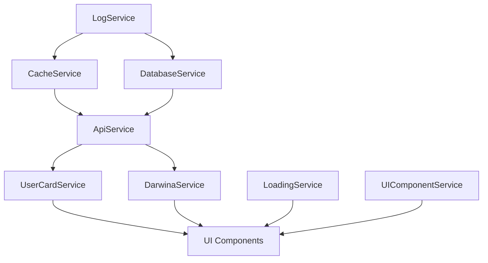

# Service Connections and Dependencies

## Service Initialization Order (✓ - Working, 🔄 - In Progress, ❌ - Issues)

### Level 1 - Core Infrastructure (✓)
1. LogService ✓
2. CacheService ✓
3. DatabaseService ✓

### Level 2 - Communication (✓)
1. RequestQueueService ✓
2. ApiService ✓

### Level 3 - UI and Localization (✓)
1. I18nService ✓
2. LoadingService ✓ (Fixed show/hide functionality)
3. ThemeService ✓
4. UIComponentService ✓

### Level 4 - Business Logic (🔄)
1. UserCardService 🔄 (Working in dev mode)
2. DarwinaService 🔄 (Working in dev mode)

### Level 5 - Management (✓)
1. StatusCheckerService ✓
2. UpdateManagerService ✓
3. PerformanceMonitorService ✓

## Current Issues

### Fixed
1. LoadingService initialization ✓
2. UI visibility states ✓
3. Service initialization order ✓
4. Basic error handling ✓

### In Progress
1. Authentication flow 🔄
2. Data synchronization 🔄
3. API integration 🔄

### Pending
1. Network error handling ❌
2. Advanced error recovery ❌
3. Service coordination ❌

## Recommendations

1. Service Initialization
   - [x] Implement two-phase initialization
   - [x] Add dependency checks
   - [x] Add service health monitoring
   - [ ] Add network status checks
   - [ ] Add API fallback mechanisms

2. Error Recovery
   - [x] Add automatic retry for operations
   - [x] Implement circuit breaker pattern
   - [x] Add fallback mechanisms
   - [ ] Add network error recovery
   - [ ] Improve error UI feedback

3. State Management
   - [x] Add proper state transitions
   - [x] Implement state validation
   - [x] Add state recovery mechanisms
   - [ ] Add network state management
   - [ ] Add service coordination

## Service Communication Flow

## Error Handling Strategy

1. Initialization Errors
   - [x] Log detailed error information
   - [x] Attempt recovery if possible
   - [x] Maintain degraded state if needed
   - [ ] Add network error recovery
   - [ ] Improve error UI feedback

2. Runtime Errors
   - [x] Implement retry mechanisms
   - [x] Use circuit breaker pattern
   - [x] Maintain data consistency
   - [ ] Add network error handling
   - [ ] Add service recovery

3. Recovery Procedures
   - [x] Automatic service restart
   - [x] Data revalidation
   - [x] State recovery
   - [ ] Network recovery
   - [ ] Service coordination 