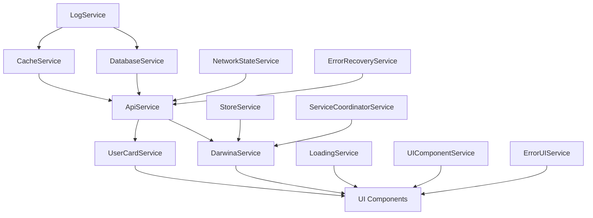

# Service Connections and Dependencies

## Service Initialization Order (✓ - Working, 🔄 - In Progress, ❌ - Issues)

### Level 1 - Core Infrastructure (✓)
1. LogService ✓
2. CacheService ✓
3. DatabaseService ✓

### Level 2 - Communication (🔄)
1. RequestQueueService ✓
2. ApiService 🔄 (Network error handling needed)
3. NetworkStateService ❌ (New - needed for network status)

### Level 3 - UI and Localization (✓)
1. I18nService ✓
2. LoadingService ✓
3. ThemeService ✓
4. UIComponentService ✓
5. ErrorUIService ❌ (New - needed for error feedback)

### Level 4 - Business Logic (🔄)
1. UserCardService 🔄
2. DarwinaService 🔄
3. StoreService ❌ (New - needed for store management)

### Level 5 - Management (🔄)
1. StatusCheckerService ✓
2. UpdateManagerService ✓
3. PerformanceMonitorService ✓
4. ErrorRecoveryService ❌ (New - needed for advanced recovery)
5. ServiceCoordinatorService ❌ (New - needed for service coordination)

## Current Issues

### Fixed
1. LoadingService initialization ✓
2. UI visibility states ✓
3. Service initialization order ✓
4. Basic error handling ✓
5. Store selection handling ✓

### In Progress
1. Authentication flow 🔄
2. Data synchronization 🔄
3. API integration 🔄
4. Store data loading 🔄
5. Network error handling 🔄

### Pending
1. Network state management ❌
2. Advanced error recovery ❌
3. Service coordination ❌
4. User settings persistence ❌
5. Store state management ❌

## Recommendations

1. Service Initialization
   - [x] Implement two-phase initialization
   - [x] Add dependency checks
   - [x] Add service health monitoring
   - [ ] Add network status checks
   - [ ] Add API fallback mechanisms
   - [ ] Add store state validation
   - [ ] Add user settings validation

2. Error Recovery
   - [x] Add automatic retry for operations
   - [x] Implement circuit breaker pattern
   - [x] Add fallback mechanisms
   - [ ] Add network error recovery
   - [ ] Improve error UI feedback
   - [ ] Add store error recovery
   - [ ] Add settings error recovery

3. State Management
   - [x] Add proper state transitions
   - [x] Implement state validation
   - [x] Add state recovery mechanisms
   - [ ] Add network state management
   - [ ] Add service coordination
   - [ ] Add store state persistence
   - [ ] Add settings state persistence

## Service Communication Flow

## Error Handling Strategy

1. Initialization Errors
   - [x] Log detailed error information
   - [x] Attempt recovery if possible
   - [x] Maintain degraded state if needed
   - [ ] Add network error recovery
   - [ ] Improve error UI feedback
   - [ ] Add store initialization recovery
   - [ ] Add settings initialization recovery

2. Runtime Errors
   - [x] Implement retry mechanisms
   - [x] Use circuit breaker pattern
   - [x] Maintain data consistency
   - [ ] Add network error handling
   - [ ] Add service recovery
   - [ ] Add store error handling
   - [ ] Add settings error handling

3. Recovery Procedures
   - [x] Automatic service restart
   - [x] Data revalidation
   - [x] State recovery
   - [ ] Network recovery
   - [ ] Service coordination
   - [ ] Store state recovery
   - [ ] Settings state recovery

## Next Steps

1. Create new services:
   - NetworkStateService
   - ErrorUIService
   - StoreService
   - ErrorRecoveryService
   - ServiceCoordinatorService

2. Update existing services:
   - DarwinaService: Add network error handling
   - ApiService: Add network state management
   - UserCardService: Add settings persistence
   - UIComponentService: Add error UI components

3. Implement missing features:
   - Network state management
   - Advanced error recovery
   - Service coordination
   - Store state management
   - Settings state management 