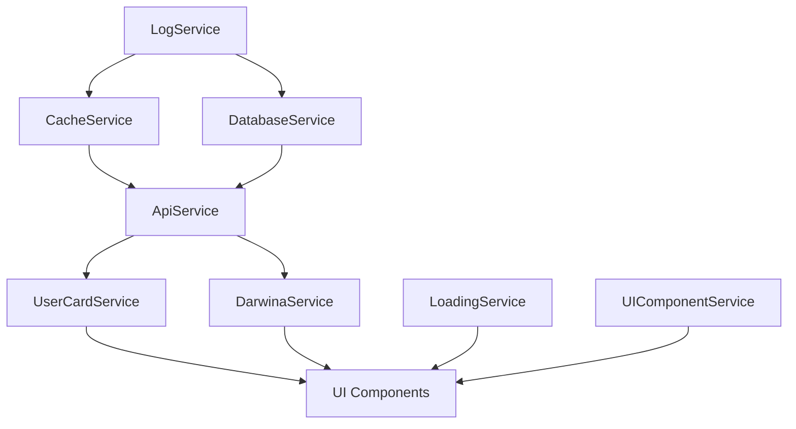

# Service Connections and Dependencies

## Service Initialization Order

### Level 1 - Core Infrastructure
1. LogService
2. CacheService
3. DatabaseService

### Level 2 - Communication
1. RequestQueueService
2. ApiService (using DARWINA.PL API configuration)

### Level 3 - UI and Localization
1. I18nService
2. LoadingService
3. ThemeService
4. UIComponentService

### Level 4 - Business Logic
1. UserCardService
2. DarwinaService (using DARWINA.PL API)

### Level 5 - Management
1. StatusCheckerService
2. UpdateManagerService
3. PerformanceMonitorService

## Service Dependencies

### UserCardService
- Depends on:
  - LogService
  - ApiService (DARWINA.PL)
  - CacheService
- Used by:
  - popup.js
  - background.js
- Status: Fixed initialization cycle

### ApiService
- Depends on:
  - LogService
  - RequestQueueService
  - CacheService
- Used by:
  - UserCardService
  - DarwinaService
- Status: Fixed API configuration

### CacheService
- Depends on:
  - LogService
- Used by:
  - ApiService
  - UserCardService
  - UpdateManagerService
- Status: Working correctly

### LoadingService
- Depends on:
  - LogService
- Used by:
  - All UI components
  - RequestQueueService
- Status: Improved state management

### UIComponentService
- Depends on:
  - LogService
  - ThemeService
  - I18nService
- Used by:
  - popup.js
  - All UI components
- Status: Initialization issues being fixed

## Current Issues

### Service Initialization
1. UIComponentService initialization:
   - Component registration timing
   - Event listener setup
   - Debug panel initialization

### State Management
1. Loading state coordination:
   - Pre-initialization state handling
   - State transitions
   - Error state management

## Recommendations

1. Service Initialization
   - [x] Implement two-phase initialization
   - [x] Add dependency checks
   - [x] Add service health monitoring
   - [ ] Add network status checks
   - [ ] Add API fallback mechanisms

2. Error Recovery
   - [x] Add automatic retry for operations
   - [x] Implement circuit breaker pattern
   - [x] Add fallback mechanisms
   - [ ] Add network error recovery
   - [ ] Improve error UI feedback

3. State Management
   - [x] Add proper state transitions
   - [x] Implement state validation
   - [x] Add state recovery mechanisms
   - [ ] Add network state management
   - [ ] Add service coordination

## Service Communication Flow

## Error Handling Strategy

1. Initialization Errors
   - [x] Log detailed error information
   - [x] Attempt recovery if possible
   - [x] Maintain degraded state if needed
   - [ ] Add network error recovery
   - [ ] Improve error UI feedback

2. Runtime Errors
   - [x] Implement retry mechanisms
   - [x] Use circuit breaker pattern
   - [x] Maintain data consistency
   - [ ] Add network error handling
   - [ ] Add service recovery

3. Recovery Procedures
   - [x] Automatic service restart
   - [x] Data revalidation
   - [x] State recovery
   - [ ] Network recovery
   - [ ] Service coordination 