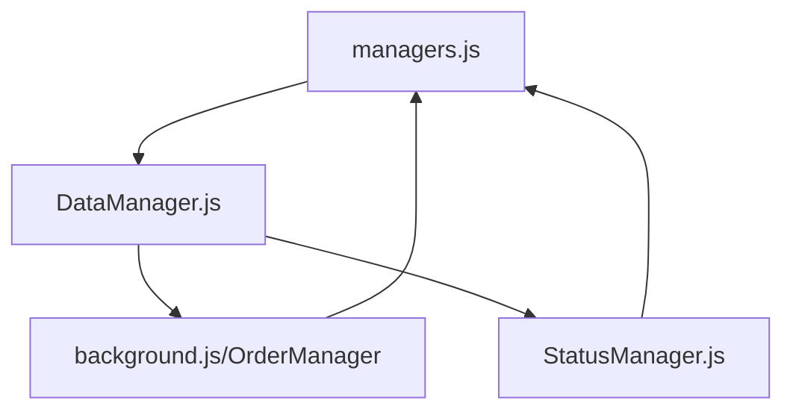

# Dependency Analysis - Current Codebase

## Current Circular Dependencies



## Current Architecture

1. **managers.js (Central Registry)**
   ```javascript
   // Current pattern
   import { DataManager } from './DataManager.js';
   import { OrderService } from '../api/OrderService.js';
   // ... more imports

   let _managerClasses = new Map();
   let _instances = new Map();
   
   // Registration
   registerManagerClass('DataManager', DataManager);
   registerManagerClass('OrderService', OrderService);
   ```

2. **DataManager.js (Problem Area)**
   ```javascript
   // Current problematic imports
   import { statusManager } from './StatusManager.js';
   import { eventManager } from './EventManager.js';
   import { errorHandler } from './ErrorHandler.js';
   
   class DataManager {
       async onInitialize() {
           // Problematic dynamic import
           const { orderManager } = await import('../../background.js');
           this.#orderManager = orderManager;
       }
   }
   ```

3. **background.js (OrderManager Location)**
   ```javascript
   import {
       getLogManager,
       getEventManager,
       // ... more imports
   } from './services/core/managers.js';

   class OrderManager extends BaseManager {
       // OrderManager implementation
   }
   ```

## Specific Issues

1. **Initialization Order Conflicts**
   - ErrorHandler needs to initialize first
   - EventManager depends on ErrorHandler
   - DataManager depends on OrderManager
   - OrderManager depends on multiple managers

2. **Current Manager Dependencies**
   ```javascript
   // Actual dependency chain
   ErrorHandler -> LogManager -> EventManager -> StorageManager -> 
   CacheManager -> DataManager -> OrderManager -> StatusManager
   ```

3. **Problematic Cross-Dependencies**
   - DataManager ↔ OrderManager
   - StatusManager ↔ DataManager
   - EventManager used everywhere

## Proposed Solutions for Current Codebase

### 1. Move OrderManager to Core Services
```javascript
// NEW: services/core/OrderManager.js
import { BaseManager } from './BaseManager.js';
export class OrderManager extends BaseManager {
    // Move from background.js to here
}
export const orderManager = OrderManager.getInstance();
```

### 2. Update Manager Registration
```javascript
// managers.js
const CORE_MANAGERS = ['ErrorHandler', 'LogManager', 'EventManager'];
const SERVICE_MANAGERS = ['OrderManager', 'DataManager', 'StatusManager'];
const UI_MANAGERS = ['UIManager', 'ThemeManager'];

function initializeByGroup(managerGroup) {
    return Promise.all(
        managerGroup.map(name => getManagerInstance(name).initialize())
    );
}
```

### 3. Event-Based State Updates
```javascript
// DataManager.js
class DataManager extends BaseManager {
    #setupEventListeners() {
        eventManager.on('orders:needed', async () => {
            const orders = await this.getOrders();
            eventManager.emit('orders:available', orders);
        });
    }
}
```

### 4. Dependency Injection for Current Managers
```javascript
// Example for DataManager
class DataManager extends BaseManager {
    constructor(dependencies = {}) {
        super('DataManager');
        this.eventManager = dependencies.eventManager || getEventManager();
        this.statusManager = dependencies.statusManager || getStatusManager();
    }
}
```

## Implementation Steps

1. **Phase 1: Immediate Fixes**
   - [x] Move OrderManager to services/core/OrderManager.js
   - [ ] Update imports in background.js to use new OrderManager location
   - [ ] Remove circular dynamic import in DataManager

2. **Phase 2: Manager Organization**
   - [ ] Group managers by layer (Core, Service, UI, Feature)
   - [ ] Update initialization order in managers.js
   - [ ] Implement proper dependency validation

3. **Phase 3: Event System Enhancement**
   - [ ] Define standard event names (orders:*, data:*, ui:*)
   - [ ] Replace direct manager calls with events
   - [ ] Add event logging for debugging

4. **Phase 4: State Management**
   - [ ] Create OrderState in OrderManager
   - [ ] Implement state subscriptions
   - [ ] Update UI components to use state

## Migration Strategy

1. **Step 1: OrderManager Migration**
   ```javascript
   // services/core/OrderManager.js
   export class OrderManager extends BaseManager {
       // Implementation
   }
   
   // background.js
   import { OrderManager } from './services/core/OrderManager.js';
   ```

2. **Step 2: Update DataManager**
   ```javascript
   // DataManager.js
   class DataManager extends BaseManager {
       async initialize() {
           await super.initialize();
           this.#setupEventListeners();
           eventManager.emit('data:ready');
       }
   }
   ```

3. **Step 3: Event System**
   ```javascript
   // Event contract
   const EVENT_TYPES = {
       ORDERS: {
           NEEDED: 'orders:needed',
           AVAILABLE: 'orders:available',
           UPDATED: 'orders:updated'
       },
       DATA: {
           READY: 'data:ready',
           ERROR: 'data:error'
       }
   };
   ```

## Success Metrics

1. **Initialization**
   - Error-free startup
   - Correct order of manager initialization
   - No "Cannot access X before initialization" errors

2. **Performance**
   - No duplicate manager instances
   - Efficient event handling
   - Minimal memory usage

3. **Maintainability**
   - Clear dependency graph
   - Documented event contract
   - Testable components

## Notes

- Keep existing getter functions in managers.js for compatibility
- Add extensive logging for initialization sequence
- Consider adding manager state validation
- Document all events in a central location
- Add error boundaries for event handling

## Additional Considerations

### Edge Cases to Handle

1. **Race Conditions**
   ```javascript
   // Current issue in DataManager
   async onInitialize() {
       const orders = await this.#orderManager.getOrders();
       await this.processOrders(orders); // Race condition if orders update during processing
   }

   // Solution: Use event system with versioning
   async onInitialize() {
       const version = Date.now();
       eventManager.emit('orders:fetch-requested', { version });
       eventManager.once(`orders:fetched:${version}`, this.processOrders.bind(this));
   }
   ```

2. **Error Recovery**
   ```javascript
   // Current issue
   async processOrders(orders) {
       if (!orders) return;  // Silent failure

   // Solution: Add proper error handling and recovery
   async processOrders(orders) {
       if (!orders) {
           eventManager.emit('data:error', { 
               type: 'MISSING_DATA',
               retryable: true
           });
           await this.attemptRecovery();
       }
   }
   ```

3. **Initialization Deadlocks**
   ```javascript
   // CORRECT - Use state checks and events
   class StatusManager {
       async onInitialize() {
           if (this.dataManager.isReady()) {
               await this.processData();
           } else {
               eventManager.once('data:ready', this.processData.bind(this));
           }
       }
   }
   ```

### State Management Pattern
```javascript
// Add to BaseManager
class BaseManager {
    #state = {
        initialized: false,
        ready: false,
        error: null
    };

    isReady() {
        return this.#state.ready;
    }

    isInitialized() {
        return this.#state.initialized;
    }

    hasError() {
        return !!this.#state.error;
    }

    setState(newState) {
        const oldState = {...this.#state};
        this.#state = {...this.#state, ...newState};
        
        // Emit state change events
        if (oldState.ready !== this.#state.ready) {
            eventManager.emit(`${this.name}:ready`, { ready: this.#state.ready });
        }
        if (oldState.error !== this.#state.error) {
            eventManager.emit(`${this.name}:error`, { error: this.#state.error });
        }
    }
}

// Usage in managers
class DataManager extends BaseManager {
    async onInitialize() {
        try {
            // Check dependencies state first
            if (!this.orderManager.isReady()) {
                eventManager.once('orderManager:ready', this.initializeData.bind(this));
                return;
            }

            await this.initializeData();
            this.setState({ ready: true });
            eventManager.emit('data:ready');
        } catch (error) {
            this.setState({ error });
            throw error;
        }
    }
}
```

### Dependency Resolution
```javascript
// managers.js
class DependencyResolver {
    static validateDependencies(manager, dependencies) {
        for (const dep of dependencies) {
            const instance = getManagerInstance(dep);
            if (!instance.isInitialized()) {
                throw new Error(`Dependency ${dep} not initialized for ${manager}`);
            }
        }
    }

    static getDependencyState(dependencies) {
        return dependencies.map(dep => ({
            name: dep,
            ready: getManagerInstance(dep).isReady(),
            error: getManagerInstance(dep).hasError()
        }));
    }
}

// Usage in initialization
async function initializeManager(name) {
    const manager = getManagerInstance(name);
    const dependencies = MANAGER_DEPENDENCIES[name] || [];
    
    // Validate dependencies are initialized
    DependencyResolver.validateDependencies(name, dependencies);
    
    // Check if dependencies are ready
    const depStates = DependencyResolver.getDependencyState(dependencies);
    const allReady = depStates.every(d => d.ready);
    
    if (!allReady) {
        // Set up event listeners for dependencies
        const readyPromises = depStates
            .filter(d => !d.ready)
            .map(d => new Promise(resolve => 
                eventManager.once(`${d.name}:ready`, resolve)
            ));
            
        // Wait for all dependencies to be ready
        await Promise.all(readyPromises);
    }

    // Initialize the manager
    await manager.initialize();
}
```

### Recovery Without Timeouts
```javascript
// Add to BaseManager
class BaseManager {
    #recoveryAttempts = 0;
    
    async recover() {
        if (this.#recoveryAttempts >= 3) {
            this.setState({ error: new Error('Max recovery attempts reached') });
            return false;
        }

        try {
            this.#recoveryAttempts++;
            await this.dispose();
            await this.initialize();
            this.#recoveryAttempts = 0;
            return true;
        } catch (error) {
            this.setState({ error });
            return false;
        }
    }
}
```

### Health Checks
```javascript
// Add to BaseManager
class BaseManager {
    isHealthy() {
        return this.isReady() && !this.hasError();
    }

    getDiagnostics() {
        return {
            name: this.name,
            state: {
                initialized: this.isInitialized(),
                ready: this.isReady(),
                error: this.hasError() ? this.#state.error : null
            },
            recoveryAttempts: this.#recoveryAttempts,
            dependencies: this.dependencies.map(dep => ({
                name: dep,
                healthy: getManagerInstance(dep).isHealthy()
            }))
        };
    }
}
```

## Deployment Strategy

1. **Phased Rollout**
   - Deploy core changes first (ErrorHandler, EventManager)
   - Monitor for 24 hours
   - Deploy service layer changes
   - Monitor for 24 hours
   - Deploy UI layer changes

2. **Rollback Plan**
   ```javascript
   // Version control in managers.js
   const MANAGER_VERSIONS = {
       ErrorHandler: '2.0.0',
       EventManager: '2.0.0',
       DataManager: '1.9.0'  // Not yet upgraded
   };

   export async function rollbackManager(managerName) {
       const manager = _instances.get(managerName);
       if (!manager) return;

       const previousVersion = MANAGER_VERSIONS[managerName];
       await manager.dispose();
       _instances.delete(managerName);
       
       // Load previous version
       const PreviousManagerClass = await import(
           `./versions/${managerName}.${previousVersion}.js`
       );
       _instances.set(managerName, new PreviousManagerClass());
   }
   ```

## Documentation Requirements

1. **Event Catalog**
   ```javascript
   // events/catalog.js
   export const EVENT_CATALOG = {
       'orders:needed': {
           description: 'Request to fetch orders',
           producer: 'DataManager',
           consumers: ['OrderManager'],
           payload: {
               storeId: 'string?',
               force: 'boolean?'
           }
       },
       // ... more events
   };
   ```

2. **Dependency Documentation**
   ```javascript
   // managers/README.md
   ## Manager Dependencies

   | Manager     | Direct Dependencies | Event Dependencies |
   |------------|--------------------|--------------------|
   | DataManager| EventManager       | orders:*, data:*   |
   | OrderManager| LogManager        | store:*, orders:*  |
   ```

## Final Checklist

- [ ] All circular dependencies removed
- [ ] Event system fully implemented
- [ ] Tests written and passing
- [ ] Performance metrics in place
- [ ] Documentation updated
- [ ] Rollback procedures tested
- [ ] Error boundaries implemented
- [ ] State management refactored
- [ ] Monitoring tools in place