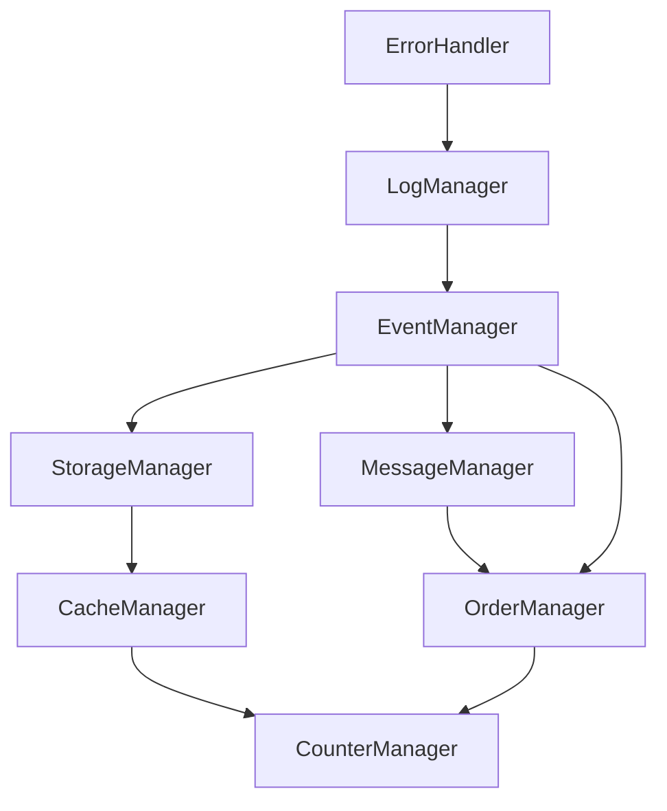

# Manager Dependency and Initialization Investigation

## Current System Analysis

### Entry Points
1. **Background Script**
   - Entry: `background.js` loads
   - Triggers: Immediate initialization
   - Problem: Races with alarm handlers

2. **Popup**
   - Entry: `popup.js` loads
   - Triggers: User opening popup
   - Problem: May initialize duplicate instances

3. **Alarm Handlers**
   - Entry: Chrome alarms firing
   - Triggers: Before system ready
   - Problem: Accessing uninitialized managers

### Initialization Sequence Issues

#### 1. Core Manager Problems
```javascript
// Current problematic sequence
ErrorHandler initializes
↓
Tries to use EventManager (fails)
↓
MenuManager creates instance
↓
Global initialization starts (too late)
```

**Should be**:
```javascript
ErrorHandler initializes
↓
LogManager initializes
↓
EventManager initializes
↓
ErrorHandler processes queued events
↓
StorageManager initializes
↓
Service managers initialize
```

#### 2. Dependency Chain Analysis



### State Management Issues

#### 1. Manager States
```typescript
type ManagerState = {
    initialized: boolean;
    ready: boolean;
    dependencies: Set<string>;
    dependents: Set<string>;
    initializationTime: number;
    errors: Error[];
}
```

Current tracking is insufficient:
- No atomic state transitions
- No cross-context synchronization
- Missing dependency readiness checks

#### 2. Initialization Flags
```javascript
let _initialized = false;
let _initializing = false;
let _initializationPromise = null;
```
Problems:
- Race conditions possible
- No granular state per manager
- No recovery mechanism

### Cross-Context Communication

#### 1. Current Flow
```
Background Context         Popup Context
     |                         |
     |---> Initialize -------->|
     |<---- Get Instance <-----|
     |---> Use Manager ------->|
```

Problems:
- No state synchronization
- Duplicate initialization
- Race conditions

#### 2. Event Timing
```javascript
// Current problematic pattern
chrome.alarms.onAlarm.addListener(async (alarm) => {
    const manager = await managers.someManager();  // May not be ready
    await manager.handleAlarm(alarm);
});
```

Should be:
```javascript
chrome.alarms.onAlarm.addListener(async (alarm) => {
    await waitForManagersReady();
    const manager = await managers.someManager();
    await manager.handleAlarm(alarm);
});
```

### Dependency Resolution

#### 1. Current Implementation
```javascript
dependencyValidator.addDependencies('ErrorHandler', []);
dependencyValidator.addDependencies('LogManager', ['ErrorHandler']);
// ...
```

Problems:
- Static definition only
- No runtime validation
- No circular dependency prevention
- No dynamic dependency loading

#### 2. Manager Access Patterns
```javascript
// Current problematic pattern
class SomeManager extends BaseManager {
    async onInitialize() {
        const eventManager = await managers.eventManager();  // May fail
        // ...
    }
}
```

Should be:
```javascript
class SomeManager extends BaseManager {
    async onInitialize() {
        await this.waitForDependencies(['EventManager']);
        const eventManager = await managers.eventManager();
        // ...
    }
}
```

## Required Changes

### 1. Initialization Control
- Create central initialization controller
- Implement state machine for initialization
- Add initialization queue
- Add dependency resolution phase

### 2. State Management
```typescript
interface ManagerStateController {
    setState(manager: string, state: ManagerState): void;
    getState(manager: string): ManagerState;
    waitForState(manager: string, state: string): Promise<void>;
    isReady(manager: string): boolean;
}
```

### 3. Event Handling
- Implement event queue
- Add event prioritization
- Add event correlation
- Add event replay mechanism

### 4. Cross-Context Communication
- Implement state sync
- Add message passing
- Add state recovery
- Add error recovery

### 5. Dependency Management
- Implement runtime dependency validation
- Add circular dependency detection
- Add dynamic dependency loading
- Add dependency health checks

## Investigation Steps

### 1. Initialization Sequence
- [ ] Log all initialization attempts
- [ ] Track manager state changes
- [ ] Monitor dependency resolution
- [ ] Analyze timing issues

### 2. State Transitions
- [ ] Map all possible states
- [ ] Track state changes
- [ ] Monitor cross-context sync
- [ ] Analyze race conditions

### 3. Event Handling
- [ ] Track event flow
- [ ] Monitor event queuing
- [ ] Analyze event timing
- [ ] Check event correlation

### 4. Dependency Resolution
- [ ] Validate dependency chains
- [ ] Check circular dependencies
- [ ] Monitor dependency health
- [ ] Analyze loading patterns

## Next Steps

1. **Immediate**
   - Implement event queuing
   - Add state tracking
   - Fix initialization order

2. **Short Term**
   - Create initialization controller
   - Implement state machine
   - Add dependency validation

3. **Long Term**
   - Refactor manager system
   - Add health monitoring
   - Implement recovery mechanisms

## Questions to Answer

1. How to handle early events before system ready?
2. How to ensure proper initialization order across contexts?
3. How to handle dependency failures?
4. How to implement proper state recovery?
5. How to prevent duplicate initialization?

## Success Criteria

1. No initialization errors
2. Proper dependency resolution
3. No race conditions
4. Proper event handling
5. Clean state management
6. Cross-context synchronization
7. Error recovery
8. Performance optimization

## Monitoring Plan

1. **Metrics to Track**
   - Initialization time
   - Dependency resolution time
   - Event processing time
   - Error rates
   - State transitions
   - Cross-context sync time

2. **Health Checks**
   - Manager state
   - Dependency health
   - Event queue size
   - Memory usage
   - Performance impact

## Implementation Phases

### Phase 1: Foundation
1. Create state controller
2. Implement event queue
3. Add dependency validation
4. Fix initialization order

### Phase 2: Robustness
1. Add state recovery
2. Implement health checks
3. Add error recovery
4. Optimize performance

### Phase 3: Enhancement
1. Add monitoring
2. Implement analytics
3. Add debugging tools
4. Optimize memory usage

## Notes
- Keep backward compatibility
- Document all changes
- Add proper logging
- Consider performance
- Plan for rollback
- Test thoroughly 