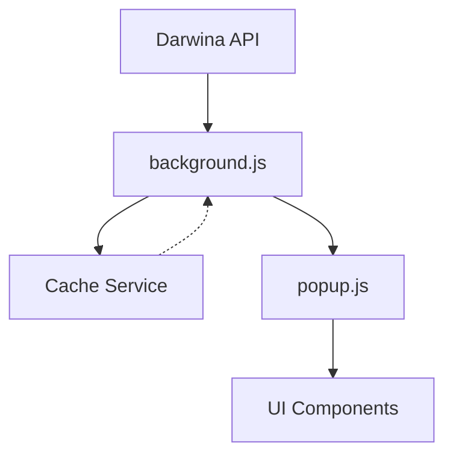

# KAMILA Project Folder Structure

## Core Directories

### `/popup`
- `popup.html` - Main extension popup interface
- `popup.js` - Popup UI logic and event handlers
- `popup.css` - Popup styling

### `/background`
- `background.js` - Background service worker
- `background.html` - Background page (if needed)

### `/services`
- `api.js` - Darwina API communication
- `cache.js` - Data caching service
- `userCard.js` - User card functionality
- `i18n.js` - Internationalization service

### `/config`
- `constants.js` - Global constants
- `status-map.js` - Status code mappings
- `settings.js` - Extension settings

### `/locales`
- `en/messages.json` - English translations
- `es/messages.json` - Spanish translations
- `pt/messages.json` - Portuguese translations
- Other language files...

### `/assets`
- `/icons` - Extension icons
- `/images` - UI images
- `/styles` - Global CSS files

### `/utils`
- `helpers.js` - Common utility functions
- `validators.js` - Data validation
- `formatters.js` - Data formatting

### `/tests`
- `popup.test.js`
- `background.test.js`
- `services/*.test.js`

### `/docs`
- `api.md` - API documentation
- `setup.md` - Setup instructions
- `folder-structure.md` - This file
- Other documentation...

## Data Flow

### Data Flow Details
1. **API → Background**
   - Background service worker handles all API calls
   - Manages authentication and headers
   - Handles rate limiting and retries

2. **Background → Cache**
   - 5-minute cache timeout
   - Stores API responses
   - Provides fallback data
   - Prevents duplicate API calls

3. **Background → Popup**
   - State updates via Chrome messaging
   - Status code translations
   - Error handling

4. **Popup → UI**
   - Bootstrap 5.x components
   - Loading states
   - Error displays
   - Status updates

## Key Files Overview

### popup.js
- Handles UI state management
- Manages Bootstrap components
- Implements loading states
- Error handling and display
- Chrome messaging with background

### background.js
- API communication layer
- Cache management
- State persistence
- Event listeners
- Message handling

### services/api.js
- Darwina API integration
- Request/response handling
- Error management
- Rate limiting
- Response parsing

### services/cache.js
- Data caching logic
- Timeout management (5-min)
- Cache invalidation
- Fallback data handling

## Best Practices

1. **API Communication**
   - Always use background.js for API calls
   - Implement proper error handling
   - Use status mappings consistently

2. **State Management**
   - Fresh API data over cache
   - Clear loading states
   - Consistent error states
   - Maintain store selection

3. **Performance**
   - Smart cache usage
   - Prevent duplicate calls
   - Optimize UI updates
   - Monitor performance metrics

4. **Development Guidelines**
   - Add console logs for debugging
   - Follow test patterns
   - Maintain documentation
   - Use consistent code style