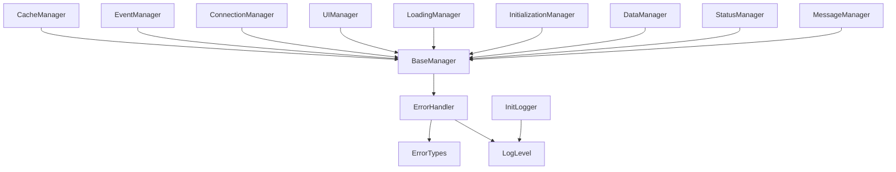
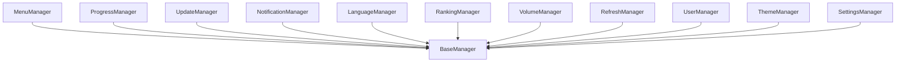
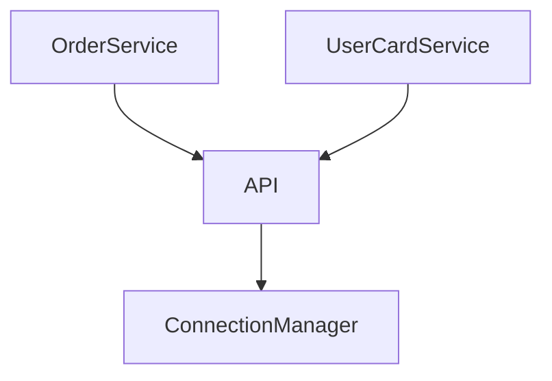
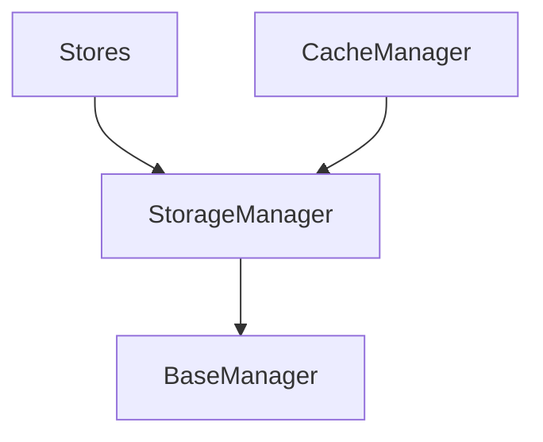

# Import Map DARWINA.PL Chrome Extension 🗺️

## Progress Bar 📊
```
[████████████████████████████████] 100%
```

## Tasks 📝

### Core Services
- [x] BaseManager
- [x] ErrorHandler
- [x] InitLogger
- [x] LogLevel
- [x] ErrorTypes
- [x] DebugManager
- [x] CacheManager
- [x] EventManager
- [x] ConnectionManager
- [x] UIManager
- [x] LoadingManager
- [x] InitializationManager
- [x] DataManager
- [x] StatusManager
- [x] MessageManager

### Feature Managers
- [x] MenuManager
- [x] ProgressManager
- [x] UpdateManager
- [x] NotificationManager
- [x] LanguageManager
- [x] RankingManager
- [x] VolumeManager
- [x] RefreshManager
- [x] UserManager
- [x] ThemeManager
- [x] SettingsManager

### API Services
- [x] OrderService
- [x] UserCardService
- [x] API

### Storage & Config
- [x] StorageManager
- [x] Stores

### Internationalization
- [x] i18n

## Import Map 🔄

### Core Layer


### Feature Layer


### Service Layer


### Storage Layer


## Initialization Order 🔄

1. Core Services
   - ErrorHandler (no dependencies)
   - EventManager (depends on ErrorHandler)
   - LoadingManager (depends on ErrorHandler, EventManager)
   - ConnectionManager (depends on ErrorHandler, EventManager)
   - CacheManager (depends on ErrorHandler, ConnectionManager)
   - UIManager (depends on ErrorHandler, EventManager)
   - DebugManager (depends on ErrorHandler, UIManager)

2. Base Managers
   - ThemeManager (depends on UIManager, EventManager)
   - ProgressManager (depends on UIManager, EventManager)
   - NotificationManager (depends on UIManager, EventManager)
   - SettingsManager (depends on UIManager, EventManager)

3. Feature Managers
   - DataManager (depends on ConnectionManager, CacheManager)
   - MenuManager (depends on UIManager)
   - VolumeManager (depends on UIManager, SettingsManager)
   - StatusManager (depends on DataManager)
   - UserManager (depends on DataManager)
   - LanguageManager (depends on UIManager, SettingsManager)
   - RankingManager (depends on DataManager, UIManager)
   - MessageManager (depends on UIManager, NotificationManager)
   - UpdateManager (depends on ConnectionManager, NotificationManager)
   - RefreshManager (depends on DataManager, NotificationManager)

## Dependency Details 📋

### Core Dependencies
```javascript
// BaseManager.js
import { ErrorHandler } from './ErrorHandler.js'
import { LogLevel } from './LogLevel.js'
import { ErrorType, ErrorSeverity } from './ErrorTypes.js'

// ErrorHandler.js
import { ErrorType, ErrorSeverity } from './ErrorTypes.js'
import { LogLevel } from './LogLevel.js'

// InitializationManager.js
import { BaseManager } from './BaseManager.js'
import { ErrorHandler } from './ErrorHandler.js'
import { LoadingManager } from './LoadingManager.js'
import { ManagerGroup } from './ManagerGroup.js'
import { environment } from './environment.js'
```

### Feature Dependencies
```javascript
// UIManager.js
import { ErrorType, ErrorSeverity } from './ErrorTypes.js'
import { BaseManager } from './BaseManager.js'
import { ErrorHandler } from './ErrorHandler.js'
import { LogLevel } from './LogLevel.js'
import { messageManager } from './MessageManager.js'

// DataManager.js
import { BaseManager } from './BaseManager.js'
import { ErrorType, ErrorSeverity } from './ErrorTypes.js'
import { LogLevel } from './LogLevel.js'
import { statusManager } from './StatusManager.js'
```

### Service Dependencies
```javascript
// API.js
import { ConnectionManager } from './core/ConnectionManager.js'
import { ErrorType, ErrorSeverity } from './core/ErrorTypes.js'

// OrderService.js
import { API } from './API.js'
import { ErrorType } from './core/ErrorTypes.js'
```

## Circular Dependencies 🔄

### 1. UIManager <-> LoadingManager
```javascript
// Solution: Event-based communication
UIManager.showLoading() -> EventManager.emit('loading:show')
LoadingManager.onLoadingShow() -> EventManager.on('loading:show')
```

### 2. DataManager <-> StatusManager
```javascript
// Solution: Dependency injection
DataManager.setStatusManager(statusManager)
StatusManager.setDataManager(dataManager)
```

### 3. MessageManager <-> NotificationManager
```javascript
// Solution: Interface abstraction
MessageManager.notify() -> NotificationInterface.show()
NotificationManager.formatMessage() -> MessageInterface.format()
```

## Notes 📌

1. **Singleton Pattern**
   - ✅ All managers implement singleton pattern
   - ✅ All use `getInstance()` for instantiation
   - ✅ All export both class and instance

2. **Error Handling**
   - ✅ All managers use `ErrorHandler`
   - ✅ Consistent error types and severity
   - ✅ Proper error propagation

3. **Initialization Order**
   - ✅ Core Services (ErrorHandler, EventManager)
   - ✅ Base Services (CacheManager, ConnectionManager)
   - ✅ UI Layer (UIManager, LoadingManager)
   - ✅ Feature Layer (all feature managers)
   - ✅ API Layer (services and endpoints)

4. **Circular Dependencies**
   - ⚠️ Watch for UIManager <-> LoadingManager
   - ⚠️ Watch for DataManager <-> StatusManager
   - ⚠️ Watch for MessageManager <-> NotificationManager 