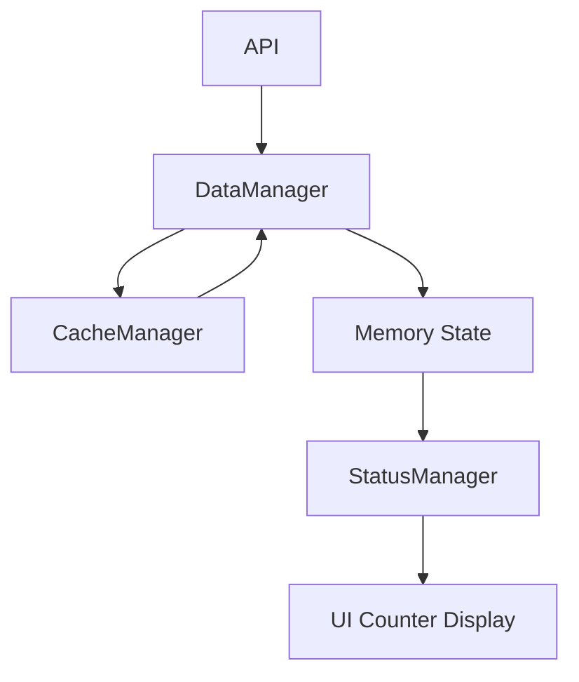
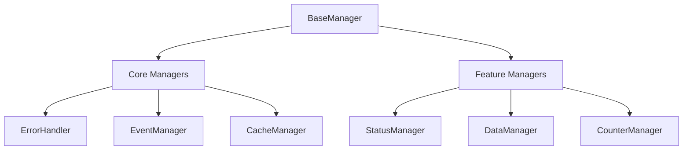
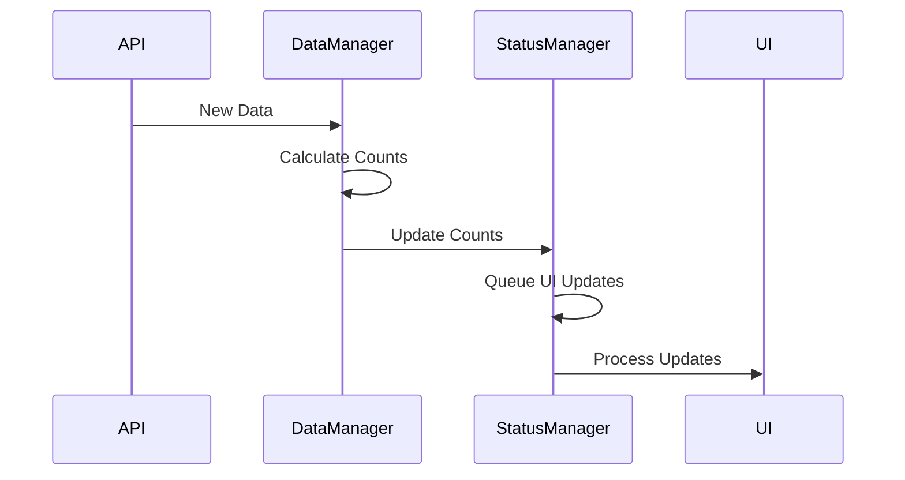
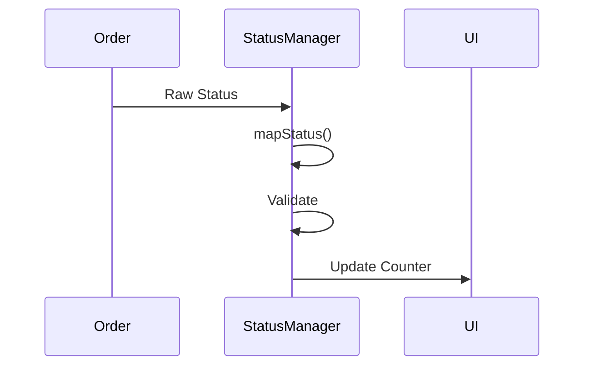

# 🔄 Orders Counter System Analysis

## 📋 Table of Contents
1. [Requirements Summary](#requirements-summary)
2. [System Architecture](#system-architecture)
3. [Component Analysis](#component-analysis)
4. [Current Issues](#current-issues)
5. [Proposed Solutions](#proposed-solutions)
6. [Implementation Plan](#implementation-plan)

## 📊 Requirements Summary

### 🎯 Core Requirements

#### 1️⃣ Order Status Management
- System tracks specific order statuses:
  ```javascript
  STATUS_MAP = {
      submitted: '1',     // New orders
      confirmed: '2',     // Confirmed by store
      accepted: '3',      // In progress
      ready: 'READY',     // Ready for pickup
      overdue: 'OVERDUE'  // Past pickup time
  }
  ```
- ✅ Single valid status per order
- ⏱️ Timestamp tracking for changes
- 🔤 Case-insensitive mapping

#### 2️⃣ Counter System
- 📈 Status Categories:
  - `'1'` → submitted
  - `'2'` → confirmed
  - `'3'` → accepted
  - `'READY'` → ready
  - `'OVERDUE'` → overdue
- 🔄 Update Triggers:
  - Initial load
  - Store changes
  - Status changes
- 🔒 Thread-safe operations
- 🎯 UI Element IDs: `count-${status}`

#### 3️⃣ Data Flow
- 🔄 Pipeline: API → DataManager → StatusManager → UI
- 💾 CacheManager integration
- 📡 Event System:
  - `store:change`
  - `status:change`
  - `orders:counts-updated`
- ✅ Multi-layer validation

## 🏗️ System Architecture

### 📐 Base Architecture (BaseManager)
- 🔄 Initialization States:
  ```javascript
  InitState = {
      IDLE: 'IDLE',
      INITIALIZING: 'INITIALIZING',
      INITIALIZED: 'INITIALIZED',
      READY: 'READY',
      FAILED: 'FAILED'
  }
  ```

- 🛠️ Core Features:
  1. **Dependency Management**
     - 🔍 Circular dependency detection
     - 📊 Initialization ordering
     - ✅ Runtime validation
  
  2. **Error Handling**
     - 🔄 Retry mechanism
     - ⏱️ Timeout handling
     - 📝 Context preservation

  3. **State Management**
     - 🔄 State transitions
     - 🔗 Dependency chain
     - 📊 Performance tracking

### 📊 Data Flow Diagram


## 🔍 Component Analysis

### 1️⃣ Manager Hierarchy


### 2️⃣ Core Components

#### BaseManager
- 🔄 **Initialization Chain**
  ```javascript
  class BaseManager {
      #initState = InitState.IDLE;
      #dependencies = new Set();
      
      async initialize() {
          // Dependency resolution
          // State management
          // Error handling
      }
  }
  ```
- 🎯 **Key Features**
  - Dependency tracking and validation
  - State management (IDLE → INITIALIZED → READY)
  - Error handling with context
  - Performance monitoring

#### StatusManager
- 🔗 **Dependencies**
  ```javascript
  // Direct dependencies
  - UIManager
  - EventManager
  - DataManager (dynamic import)
  ```
- 🎯 **Core Functionality**
  ```javascript
  class StatusManager extends BaseManager {
      #services = {
          api: false,
          auth: false,
          orders: false,
          cache: false
      };
      #pendingUIUpdates = new Set();
      
      static mapStatus(status) {
          return STATUS_MAP[status.toLowerCase()] || status;
      }
  }
  ```
- 📡 **Event Handling**
  - Listens to: 'ui:ready', 'service:status', 'store:change'
  - Emits: 'status:change', 'orders:counts-updated'

#### DataManager
- 🔗 **Dependencies**
  ```javascript
  - StatusManager
  - EventManager
  - ErrorHandler
  ```
- 🎯 **Core Functionality**
  ```javascript
  class DataManager extends BaseManager {
      #statusManager = null;
      #isRefreshing = false;
      #lastUpdate = null;
      
      async loadAndUpdateData(forceRefresh = false) {
          // Cache/API data handling
          // Counter calculations
          // Status updates
      }
  }
  ```

### 3️⃣ Data Flow Analysis

#### Counter Update Flow


#### Status Mapping Flow


### 4️⃣ Critical Paths

1. **Initialization Order**
   ```javascript
   // From managers.js
   dependencyValidator.addDependencies('StatusManager', [
       'ErrorHandler',
       'DataManager',
       'UIManager',
       'StoreManager'
   ]);
   ```

2. **Counter Update Path**
   ```javascript
   DataManager
     .loadAndUpdateData()
     ._calculateOrderCounts()
     → StatusManager
     .updateOrderCounts()
     .#processPendingUIUpdates()
   ```

3. **Status Validation Path**
   ```javascript
   StatusManager
     .mapStatus()
     → STATUS_MAP lookup
     → Counter Update
     → UI Refresh
   ```

## ❌ Current Issues

### 1️⃣ Status Management
- 🔤 Case sensitivity problems
- ❌ Missing status validation
- 🔄 Unclear status transitions

### 2️⃣ Counter System
- 🔒 Race conditions
- ❌ No atomic updates
- ✅ Missing validation

### 3️⃣ Cache Layer
- 🔄 Improper data merging
- ⏱️ Missing delta updates
- 🗑️ Invalid cache handling

## 💡 Proposed Solutions

### 🚀 Immediate Fixes
1. **Status Mapping**
   ```javascript
   static mapStatus(status) {
       const normalized = status.toLowerCase().trim();
       const mapped = STATUS_MAP[normalized];
       if (!mapped) {
           this.handleError(new Error(`Invalid status: ${status}`));
       }
       return mapped;
   }
   ```

2. **Counter Updates**
   ```javascript
   async updateCounters(newCounts) {
       return this.executeWithRetry(
           async () => {
               await this.validateState();
               await this.atomicUpdate(newCounts);
               await this.notifyUI();
           }
       );
   }
   ```

### 📈 Long-term Improvements
1. **State Management**
   - 🔒 Atomic operations
   - 📊 State validation
   - 🔄 Event system

2. **Cache Strategy**
   - 💾 Version control
   - 🔄 Delta updates
   - ✅ Data integrity

## 📋 Implementation Plan

### 1️⃣ Phase One: Core Fixes
- [ ] Fix status mapping
- [ ] Implement atomic updates
- [ ] Add validation

### 2️⃣ Phase Two: Enhancements
- [ ] Improve error handling
- [ ] Add monitoring
- [ ] Enhance logging

### 3️⃣ Phase Three: Optimization
- [ ] Performance improvements
- [ ] Cache optimization
- [ ] UI enhancements

## 📊 Monitoring & Metrics

### 1️⃣ Key Metrics
- ⏱️ Update times
- 📈 Error rates
- 💾 Cache performance

### 2️⃣ Alerts
- ❌ System failures
- ⚠️ Data inconsistencies
- 🔍 Performance issues

## 1. Data Flow Chain


## 2. Component Analysis

### 2.0 BaseManager (Core Foundation)
- **Initialization States**:
  ```javascript
  export const InitState = {
      IDLE: 'IDLE',
      INITIALIZING: 'INITIALIZING',
      INITIALIZED: 'INITIALIZED',
      READY: 'READY',
      FAILED: 'FAILED'
  }
  ```

- **Core Features**:
  1. **Dependency Management**
     - Circular dependency detection
     - Dependency initialization ordering
     - Runtime dependency validation
     - Dependency state tracking

  2. **Error Handling & Retry Logic**
     ```javascript
     async executeWithRetry(fn, options = {
         maxRetries = MAX_RETRY_ATTEMPTS,
         baseDelay = getRetryDelay(),
         maxDelay = 10000,
         timeout,
         shouldRetry = (error) => {...},
         backoff = (attempt) => {...}
     })
     ```

  3. **Initialization Flow**
     - State management (IDLE → INITIALIZING → INITIALIZED → READY)
     - Dependency chain resolution
     - Timeout handling
     - Performance tracking

  4. **Logging System**
     ```javascript
     log(level, message, data = null) {
         const timestamp = new Date().toISOString();
         const prefix = `${timestamp} [${this.name}]`;
         // Structured logging implementation
     }
     ```

- **Critical Methods**:
  1. **initialize()**
     - Handles dependency initialization
     - Prevents circular dependencies
     - Manages initialization state
     - Tracks performance metrics

  2. **waitForReady()**
     - Promise-based readiness check
     - Dependency chain completion
     - State synchronization

  3. **handleError()**
     - Structured error handling
     - Context preservation
     - Error propagation
     - Debug information collection

### 2.1 Impact on Counter System

1. **Initialization Chain**
   ```mermaid
   graph TD
       A[BaseManager] --> B[DataManager]
       A --> C[StatusManager]
       A --> D[CacheManager]
       B --> E[Counter Updates]
       C --> E
       D --> E
   ```

2. **Error Handling Flow**
   ```mermaid
   graph TD
       A[Counter Error] --> B[BaseManager.handleError]
       B --> C[Error Context Collection]
       C --> D[Error Handler]
       D --> E[UI Update]
       D --> F[Error Recovery]
   ```

3. **State Management**
   - Atomic state transitions
   - Event propagation
   - Error recovery
   - Performance monitoring

### 2.2 Current BaseManager-Related Issues

1. **Dependency Resolution**
   - Status updates may occur before full initialization
   - Potential race conditions in dependency chain
   - Missing dependency validation for counter system

2. **Error Recovery**
   - No specific retry strategy for counter operations
   - Missing state recovery for failed counter updates
   - Incomplete error context for counter-related issues

3. **State Synchronization**
   - Counter updates during initialization
   - State consistency across manager chain
   - Event ordering in multi-manager updates

### 2.3 Required BaseManager Enhancements

1. **Immediate**
   - Add counter-specific error handling
   - Implement atomic state updates
   - Add performance tracking for counter operations
   - Enhance logging for counter state changes

2. **Short-term**
   - Implement counter-specific retry strategies
   - Add state validation in dependency chain
   - Enhance error recovery for counter operations
   - Add counter operation metrics

3. **Long-term**
   - Implement comprehensive state management
   - Add counter operation monitoring
   - Enhance performance tracking
   - Implement advanced error recovery

### 2.4 BaseManager Integration Points

1. **Counter System Integration**
   ```javascript
   class CounterManager extends BaseManager {
       async onInitialize() {
           // Add counter-specific initialization
           // Setup dependencies
           // Initialize state
           // Setup error handling
       }

       async handleCounterUpdate() {
           return this.executeWithRetry(
               async () => {
                   // Counter update logic
               },
               {
                   maxRetries: 3,
                   shouldRetry: (error) => {
                       // Counter-specific retry logic
                   }
               }
           );
       }
   }
   ```

2. **Error Handling Enhancement**
   ```javascript
   handleError(error, type, severity, context) {
       // Add counter-specific context
       const counterContext = {
           ...context,
           counterState: this.getCounterState(),
           lastUpdate: this.getLastUpdate(),
           pendingUpdates: this.getPendingUpdates()
       };
       super.handleError(error, type, severity, counterContext);
   }
   ```

3. **State Management Enhancement**
   ```javascript
   async updateCounterState(newState) {
       await this.executeWithRetry(
           async () => {
               // Validate state
               // Update atomically
               // Emit events
               // Update UI
           },
           {
               timeout: 5000,
               maxRetries: 3
           }
       );
   }
   ```

### 2.1 API Layer
- **Current Implementation**:
  - Basic GET request to `/orders`
  - No delta updates implementation
  - No error handling for partial data
- **Issues**:
  - Missing `modified_from` parameter usage
  - No retry mechanism for failed requests
  - No data validation before processing

### 2.2 DataManager
- **Current Implementation**:
  ```javascript
  async loadAndUpdateData(forceRefresh = false) {
      if (!forceRefresh) {
          const cachedData = await this.#loadFromCache();
          if (cachedData) {
              await this.#updateData(cachedData);
              return true;
          }
      }
      const data = await this.#fetchData();
      // ...
  }
  ```
- **Issues**:
  - Cache-only or API-only approach, no merging
  - No timestamp tracking for updates
  - Potential race conditions in data updates
  - Missing validation of data structure

### 2.3 CacheManager
- **Current Implementation**:
  - Implements compression for large datasets
  - Has TTL mechanism
  - Supports priority levels
- **Issues**:
  - No versioning for cache structure
  - No partial cache updates
  - Missing cache invalidation strategy
  - No data integrity checks

### 2.4 Memory State
- **Current Implementation**:
  - Simple in-memory storage
  - No structured state management
- **Issues**:
  - Potential memory leaks
  - No clear update patterns
  - Missing state immutability

### 2.5 StatusManager
- **Current Implementation**:
  - Status mapping logic
  - Counter management
- **Issues**:
  - Unclear status mapping rules
  - No validation of status transitions
  - Missing status normalization

### 2.6 UI Layer
- **Current Implementation**:
  - Direct display of counter values
- **Issues**:
  - No loading states
  - Missing error states
  - No optimistic updates

## 3. Critical Issues

### 3.1 Data Synchronization
1. **Cache-API Sync**
   - No proper merging of cached and fresh data
   - Missing delta update mechanism
   - No conflict resolution strategy

2. **Status Updates**
   - Status changes not properly propagated
   - Missing validation of status transitions
   - No audit trail of changes

3. **Counter Updates**
   - Possible race conditions in counter increments
   - No atomic updates
   - Missing validation of counter states

### 3.2 Error Handling
1. **Network Errors**
   - No proper retry mechanism
   - Missing fallback strategy
   - Incomplete error reporting

2. **Data Validation**
   - Insufficient input validation
   - No schema validation
   - Missing data integrity checks

3. **State Recovery**
   - No clear recovery mechanism
   - Missing state restoration logic
   - Incomplete error boundaries

## 4. Proposed Solutions

### 4.1 Immediate Fixes
1. **Implement Proper Data Merging**
   ```javascript
   async mergeOrderData(cached, fresh) {
       const orderMap = new Map(cached.map(order => [order.id, order]));
       fresh.forEach(order => orderMap.set(order.id, order));
       return Array.from(orderMap.values());
   }
   ```

2. **Add Delta Updates**
   ```javascript
   async fetchDeltaUpdates(lastUpdateTime) {
       return await fetch(`/orders?modified_from=${lastUpdateTime}`);
   }
   ```

3. **Implement Status Validation**
   ```javascript
   validateStatus(status) {
       const validStatuses = ['submitted', 'confirmed', 'accepted', 'ready', 'overdue'];
       return validStatuses.includes(status.toLowerCase());
   }
   ```

### 4.2 Long-term Improvements
1. **State Management**
   - Implement proper state management system
   - Add state immutability
   - Implement proper event system

2. **Cache Strategy**
   - Add cache versioning
   - Implement partial cache updates
   - Add cache warming mechanism

3. **Error Handling**
   - Implement comprehensive error handling
   - Add retry mechanisms
   - Implement proper logging

## 5. Implementation Plan

### Phase 1: Data Flow Fix
1. Fix data merging in DataManager
2. Implement proper cache invalidation
3. Add status validation

### Phase 2: State Management
1. Implement proper state management
2. Add event system
3. Fix counter updates

### Phase 3: Error Handling
1. Add comprehensive error handling
2. Implement retry mechanisms
3. Add proper logging

### Phase 4: UI Updates
1. Add loading states
2. Implement error states
3. Add optimistic updates

## 6. Testing Strategy

### 6.1 Unit Tests
- Test data merging logic
- Test status validation
- Test counter calculations

### 6.2 Integration Tests
- Test API-Cache sync
- Test state updates
- Test UI updates

### 6.3 End-to-End Tests
- Test complete data flow
- Test error scenarios
- Test recovery mechanisms

## 7. Monitoring

### 7.1 Metrics to Track
- Cache hit/miss ratio
- API response times
- Error rates
- Counter update times

### 7.2 Alerts
- API failures
- Cache corruption
- Counter inconsistencies
- State synchronization issues

## 8. Next Steps

1. **Immediate Actions**
   - Implement data merging fix
   - Add status validation
   - Fix counter updates

2. **Short-term Tasks**
   - Implement delta updates
   - Add proper error handling
   - Improve logging

3. **Long-term Goals**
   - Implement proper state management
   - Add comprehensive testing
   - Improve monitoring

## 🔄 Old vs New Implementation Comparison

### 📊 Architecture Comparison

#### Old Implementation (Working)
- 🎯 **Simple and Direct Flow**
  ```javascript
  PopupManager
    → StatusManager
    → LeadCountManager
    → UI Updates
  ```
- ✅ Clear separation of concerns
- 🔒 Lock-based synchronization
- 📦 Simple caching (5-minute timeout)
- 🔄 Immediate UI feedback

#### Current Implementation
- 🏗️ **Complex Architecture**
  ```javascript
  BaseManager
    → Multiple Managers
    → Event System
    → UI Updates
  ```
- 🔄 Event-driven architecture
- 💾 Multi-layer caching
- 🎯 Dependency injection

### 💡 Key Differences

#### 1️⃣ Status Management
- **Old**: 
  - Direct status mapping
  - Simple validation
  - Immediate UI updates
  ```javascript
  const statusMap = {
      '1': 'submitted',
      '2': 'confirmed',
      '3': 'accepted',
      'READY': 'ready',
      'OVERDUE': 'overdue'
  };
  ```
- **New**:
  - Complex status transitions
  - Validation layers
  - Queued UI updates

#### 2️⃣ Counter Updates
- **Old**:
  - Atomic updates with locks
  - Direct storage access
  - Simple retry mechanism
  ```javascript
  async updateLeadCounts(newCounts, oldCounts = {}) {
      if (JSON.stringify(newCounts) !== JSON.stringify(currentCounts)) {
          await chrome.storage.local.set({ leadCounts: newCounts });
          // Immediate UI update
      }
  }
  ```
- **New**:
  - Event-based updates
  - Multiple manager coordination
  - Complex state management

#### 3️⃣ Cache Management
- **Old**:
  - Simple timeout-based cache
  - Direct invalidation
  ```javascript
  this.cacheTimeout = 5 * 60 * 1000; // 5 minutes
  ```
- **New**:
  - Multi-layer caching
  - Complex invalidation rules
  - Delta updates

### 🎯 Working Elements from Old Implementation

1. **Lock-based Synchronization**
   ```javascript
   class LeadCountManager {
       constructor() {
           this.updateLock = false;
           this.updateQueue = [];
       }
       
       async queueUpdate(updateFn) {
           return new Promise((resolve, reject) => {
               this.updateQueue.push({ fn: updateFn, resolve, reject });
               this.processQueue();
           });
       }
   }
   ```

2. **Simple Status Mapping**
   ```javascript
   const statusMap = {
       'count-1': 'submitted',
       'count-2': 'confirmed',
       'count-3': 'accepted',
       'count-ready': 'ready',
       'count-overdue': 'overdue'
   };
   ```

3. **Direct UI Updates**
   ```javascript
   function updateCounters(counts) {
       Object.entries(counts).forEach(([status, count]) => {
           const mappedStatus = statusMap[status];
           if (mappedStatus) {
               const statusElement = document.querySelector(
                   `.lead-status[data-status="${mappedStatus}"]`
               );
               // Immediate update
           }
       });
   }
   ```

### 🔧 Recommended Hybrid Approach

1. **Simplified Architecture**
   - Keep the base manager for dependency injection
   - Remove unnecessary abstraction layers
   - Maintain direct UI updates for counters

2. **Enhanced Synchronization**
   - Adopt the old lock-based system
   - Add event emission for specific cases
   - Maintain simple cache invalidation

3. **Robust Status Management**
   - Keep simple status mapping
   - Add validation layer
   - Maintain direct updates with retry mechanism

4. **Optimized Cache Strategy**
   - Use timeout-based cache with versioning
   - Implement simple delta updates
   - Keep direct storage access pattern

// ... existing code ... 