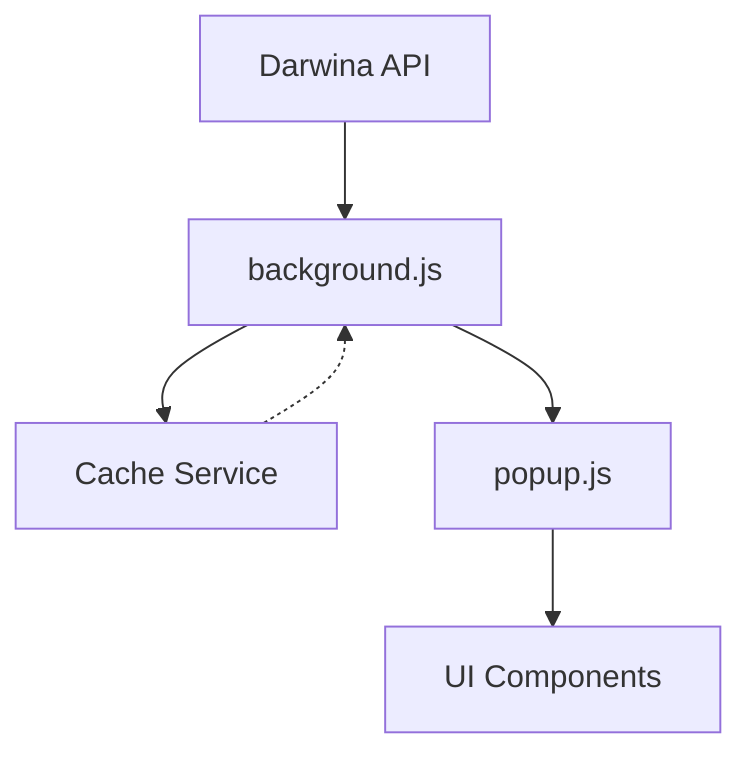

<!-- META INSTRUCTIONS -->
<goal>
  The goal of these instructions is to provide a comprehensive understanding of the KAMILA Chrome Extension project, its architecture, and development guidelines for the team.
</goal>

<instructions>
  <instruction>Follow the established code structure and patterns</instruction>
  <instruction>Maintain consistent error handling and logging</instruction>
  <instruction>Ensure proper testing coverage for all new features</instruction>
  <instruction>Keep performance metrics within specified thresholds</instruction>
  <instruction>Document all major changes and API integrations</instruction>
</instructions>

<sections>
  <section name="user-input-example">
    <description>
      User interactions include:
      - Order status queries
      - Theme customization
      - Language switching
      - Debug panel operations
    </description>
  </section>

  <section name="example-output">
    <example>
      <output>
        - Clear status indicators
        - Localized responses
        - Proper error messages
        - Performance metrics
      </output>
    </example>
  </section>
</sections>

<sections>
  <section name="project-files-reference">
    <description>
      Key project files:
      - manifest.json: Extension configuration and permissions
      - background.js: Service worker and API communication
      - popup.js: Main UI logic and event handling
      - services/*.js: Core functionality modules
      - tests/*: Comprehensive test suites
    </description>
  </section>

<input-format>
  Purpose: This document serves as the central reference for understanding KAMILA's architecture, development guidelines, and project objectives.
</input-format>
<!-- END META INSTRUCTIONS -->

<!-- PROJECT OVERVIEW -->
# KAMILA Project Overview

## Brief Description
KAMILA is an intelligent Chrome extension designed for DARWINA.PL employees to streamline their daily operations. It provides real-time order monitoring, multilingual support, and intelligent decision-making capabilities through various system integrations. The extension emphasizes performance, accessibility, and user experience while maintaining robust security standards.

## Key Objectives

### Business Goals
1. **Order Management Optimization**
   - Real-time order status monitoring
   - Automated status updates every 5 minutes
   - Intelligent order prioritization
   - Overdue order alerts

2. **Employee Efficiency**
   - Quick access to vital data
   - Streamlined decision-making support
   - Reduced manual data entry
   - Automated routine tasks

3. **System Integration**
   - Seamless Darwina API integration
   - n8n workflow automation
   - Make.com process integration
   - Multi-system data synchronization

### Technical Goals
1. **Performance Metrics**
   - UI response time < 50ms
   - API response caching (5-min timeout)
   - Animation performance at 60fps
   - Memory usage < 100MB

2. **Accessibility Standards**
   - WCAG 2.1 AA compliance
   - Screen reader optimization
   - Keyboard navigation support
   - High contrast theme options

3. **Code Quality**
   - 90%+ test coverage
   - Automated E2E testing
   - Consistent error handling
   - Comprehensive documentation

## Technical Requirements

### Performance Requirements
- Initial load time < 2 seconds
- Theme switching < 50ms
- API response time < 500ms
- Cache invalidation every 5 minutes
- Memory usage optimization
- Smooth UI animations (60fps)

### Browser Compatibility
- Chrome Version: 88+
- Manifest Version: 3
- ES2020+ JavaScript
- CSS Grid/Flexbox support

## Architecture Overview

### Core Components
1. **Frontend Layer**
   - `popup.html/js`: Main user interface
   - Bootstrap 5.x components
   - Custom theme system
   - Responsive design

2. **Background Service**
   - `background.js`: Service worker
   - API communication handler
   - Cache management
   - State persistence

3. **Service Layer**
   - API integration services
   - Cache service (5-min timeout)
   - Theme management
   - Internationalization (i18n)

### Data Flow

### Security Measures
1. **API Security**
   - OAuth2 authentication
   - API key rotation
   - Rate limiting
   - HTTPS enforcement

2. **Data Protection**
   - Local storage encryption
   - Secure credential handling
   - XSS prevention
   - CSP implementation

### Testing Strategy
1. **Unit Testing**
   - Jest framework
   - 90%+ coverage requirement
   - Mock service workers
   - Snapshot testing

2. **E2E Testing**
   - Puppeteer automation
   - Cross-browser testing
   - Performance metrics
   - User flow validation

## Development Guidelines

### Code Standards
1. **JavaScript**
   - ES2020+ features
   - Modular architecture
   - Clear documentation
   - Consistent error handling

2. **CSS/Styling**
   - BEM methodology
   - CSS variables for theming
   - Mobile-first approach
   - Performance optimization

3. **Testing Requirements**
   - Unit tests for all new features
   - E2E tests for critical paths
   - Performance benchmarks
   - Accessibility testing

### Version Control
1. **Branch Strategy**
   - main: production releases
   - develop: integration branch
   - feature/*: new features
   - hotfix/*: urgent fixes

2. **Commit Guidelines**
   - Conventional commits
   - Clear descriptions
   - Linked issues
   - Code review requirements

## Project Management

### Release Cycle
1. **Development Phase**
   - Feature implementation
   - Unit testing
   - Code review
   - Documentation

2. **Testing Phase**
   - Integration testing
   - E2E testing
   - Performance testing
   - Security audit

3. **Deployment Phase**
   - Version bump
   - Changelog update
   - Chrome Web Store submission
   - User notification

### Maintenance
1. **Monitoring**
   - Performance metrics
   - Error tracking
   - Usage statistics
   - User feedback

2. **Updates**
   - Security patches
   - Bug fixes
   - Feature enhancements
   - Documentation updates

### Support Channels
- GitHub Issues
- Internal Wiki
- Team Chat
- Email Support

## Future Roadmap
1. **Q3 2024**
   - Automated deployment pipeline
   - Enhanced caching system
   - Advanced theme customization
   - Performance optimization

2. **Q4 2024**
   - AI-powered suggestions
   - Real-time collaboration
   - Extended API integration

