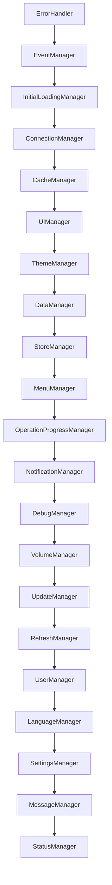

# Łańcuch startowy aplikacji Kamila - Nowe Podejście

## 1. Inicjalizacja Podstawowa [Pre-Init]
1. Załadowanie popup.html
2. Załadowanie plików CSS (bootstrap, icons, style.css, theme.css, test.css)
3. Załadowanie popup.js jako moduł
4. Inicjalizacja i18n (tłumaczenia)
   ```
   - Ładowanie tłumaczeń dla języka polskiego
   - Inicjalizacja systemu i18n
   ```

## 2. Inicjalizacja Core Services [Core]
1. ErrorHandler (0ms)
   ```
   - Pierwsza inicjalizacja przed wszystkimi managerami
   - Czas inicjalizacji: 1.70ms
   ```

2. Rejestracja Managerów
   ```
   Optymalny porządek inicjalizacji:
   ErrorHandler -> EventManager -> InitialLoadingManager -> ConnectionManager -> 
   CacheManager -> UIManager -> ThemeManager -> DataManager -> StoreManager -> 
   MenuManager -> OperationProgressManager -> NotificationManager -> DebugManager -> 
   VolumeManager -> UpdateManager -> RefreshManager -> UserManager -> LanguageManager -> 
   SettingsManager -> MessageManager -> StatusManager
   ```

## 3. Inicjalizacja Managerów [Managers]

### 3.1 Core Layer (Warstwa Podstawowa)
1. LanguageManager (12.30ms)
2. InitialLoadingManager (1.80ms)
3. EventManager (0.40ms)
4. ConnectionManager (0.70ms)
   ```
   - Tryb deweloperski - pomijanie sprawdzania połączenia
   ```
5. CacheManager (26.30ms)

### 3.2 UI Layer (Warstwa Interfejsu)
1. UIManager (20.30ms)
   ```
   - Inicjalizacja tooltipów
   - Inicjalizacja modali
   - Inicjalizacja event listenerów
   ```
2. DebugManager (9.80ms)
   ```
   - Tworzenie panelu debug
   - Ładowanie stanu debugowania
   - Inicjalizacja przełącznika debug
   ```
3. ThemeManager (7.20ms)

### 3.3 Progress Layer (Warstwa Postępu)
1. OperationProgressManager (0.50ms)
2. MenuManager (1.60ms)
   ```
   - Ustawienie aktywnej zakładki (#chat)
   - Inicjalizacja 6 elementów zakładek
   ```

### 3.4 Data Layer (Warstwa Danych)
1. StoreManager (68.30ms)
   ```
   - Ładowanie sklepów
   - Zmiana aktywnego sklepu
   ```
2. InterfaceManager (15.70ms)
3. DataManager (57.60ms)
   ```
   - Aktualizacja liczników zamówień
   - Emisja zdarzeń orders:counts-updated
   ```

### 3.5 Feature Layer (Warstwa Funkcjonalności)
1. StatusManager (9.40ms)
   ```
   - Subskrypcja zdarzeń: ui:ready, service:status, store:change
   - Aktualizacja liczników zamówień
   ```
2. UserManager (0.80ms)
3. NotificationManager (0.80ms)
4. UpdateManager (2.30ms)
   ```
   - Subskrypcja zdarzenia update-available
   - Wyłączenie interwału sprawdzania aktualizacji w trybie dev/prod
   ```
5. RefreshManager (3.50ms)
6. RankingManager (0.00ms)
7. SettingsManager (0.00ms)
8. MessageManager (0.20ms)

## 4. Finalizacja Inicjalizacji [Post-Init]
1. Zamknięcie ekranu ładowania
   ```
   - Czas całkowitej inicjalizacji: 2011.60ms
   ```

2. Inicjalizacja API
   ```
   - Ładowanie poświadczeń
   - Inicjalizacja OrderService
   - Walidacja poświadczeń
   ```

3. Pierwsze pobranie danych
   ```
   - Wybór sklepu (HRU)
   - Pobranie zamówień
   - Aktualizacja liczników
   - Aktualizacja cache'u
   ```

## 5. Czasy Inicjalizacji [Timing]
```
Total: 2011.60ms
- LanguageManager:    12.30ms
- InitialLoadingManager: 1.80ms
- EventManager:        0.40ms
- ConnectionManager:   0.70ms
- CacheManager:       26.30ms
- UIManager:          20.30ms
- DebugManager:        9.80ms
- ThemeManager:        7.20ms
- OperationProgressManager: 0.50ms
- MenuManager:         1.60ms
- StoreManager:       68.30ms
- InterfaceManager:   15.70ms
- DataManager:        57.60ms
- StatusManager:       9.40ms
- UserManager:         0.80ms
- NotificationManager: 0.80ms
- UpdateManager:       2.30ms
- RefreshManager:      3.50ms
- RankingManager:      0.00ms
- SettingsManager:     0.00ms
- MessageManager:      0.20ms
```

## 6. Zależności [Dependencies]


## 7. Obsługa Błędów [Error Handling]
1. Poziomy błędów
   ```
   - LOW: Błędy niekrytyczne (np. nieudane odświeżanie UI)
   - MEDIUM: Błędy funkcjonalne (np. nieudane pobranie danych)
   - HIGH: Błędy krytyczne (np. błąd inicjalizacji managera)
   - CRITICAL: Błędy blokujące (np. brak połączenia z API)
   ```

2. Strategie obsługi
   ```
   - Retry Logic: Maksymalnie 3 próby z exponential backoff
   - Graceful Degradation: Kontynuacja działania z ograniczoną funkcjonalnością
   - Fallback: Użycie cache'u gdy API niedostępne
   - User Notification: Informowanie użytkownika o błędach
   ```

3. Logowanie błędów
   ```
   - Console: Szczegółowe logi dla developerów
   - UI: Przyjazne komunikaty dla użytkownika
   - ErrorHandler: Centralne zarządzanie błędami
   - Metrics: Śledzenie częstotliwości i typów błędów
   ```

## 8. System Zdarzeń [Event System]
1. Core Events
   ```
   - ui:ready: Interfejs gotowy do interakcji
   - store:change: Zmiana aktywnego sklepu
   - orders:counts-updated: Aktualizacja liczników zamówień
   - service:status: Zmiana statusu serwisu
   - update-available: Dostępna aktualizacja
   ```

2. Event Flow
   ```mermaid
   graph LR
      A[UI Events] --> B[EventManager]
      B --> C[Manager Handlers]
      C --> D[State Updates]
      D --> E[UI Updates]
   ```

## 9. Czyszczenie Zasobów [Cleanup]
1. Sekwencja zamykania
   ```
   1. Zatrzymanie interwałów odświeżania
   2. Anulowanie pending requests
   3. Czyszczenie event listenerów
   4. Zamykanie połączeń WebSocket
   5. Czyszczenie cache'u tymczasowego
   ```

2. Disposal managerów
   ```javascript
   async dispose() {
     // Czyszczenie w odwrotnej kolejności inicjalizacji
     for (const manager of managers.reverse()) {
       await manager.dispose();
     }
   }
   ```

3. Zachowanie stanu
   ```
   - Zapisanie stanu aplikacji
   - Zachowanie krytycznych danych w cache
   - Czyszczenie wrażliwych danych
   - Reset flag inicjalizacji
   ```

## 10. Metryki i Monitoring [Metrics]
1. Kluczowe metryki
   ```
   - Czas inicjalizacji managerów
   - Zużycie pamięci
   - Liczba błędów
   - Czas odpowiedzi API
   - Cache hit ratio
   ```

2. Performance marks
   ```javascript
   performance.mark('init-start');
   // ... inicjalizacja ...
   performance.mark('init-end');
   performance.measure('initialization', 'init-start', 'init-end');
   ```

3. Monitoring
   ```
   - Logi debugowania
   - Metryki wydajności
   - Śledzenie błędów
   - Statystyki użycia
   ```

## 11. Optymalizacje [Optimizations]
1. Lazy Loading
   ```
   - Odroczenie ładowania niekrytyczynych managerów
   - Dynamiczny import modułów
   - Priorytetyzacja inicjalizacji UI
   ```

2. Caching
   ```
   - Cache API responses
   - Store manager state
   - Persist UI preferences
   - Memoize heavy computations
   ```

3. Performance
   ```
   - Batch DOM updates
   - Minimize reflows
   - Optimize event listeners
   - Use requestAnimationFrame
   ```

## 12. Bezpieczeństwo [Security]
1. Dane wrażliwe
   ```
   - Szyfrowanie credentiali
   - Bezpieczne przechowywanie tokenów
   - Czyszczenie danych przy wylogowaniu
   ```

2. Komunikacja
   ```
   - HTTPS only
   - Walidacja odpowiedzi API
   - Sanityzacja danych wejściowych
   - Zabezpieczenie przed XSS
   ```

3. Permissions
   ```
   - Minimum required permissions
   - Secure storage access
   - API scope limitations
   - Content security policy
   ``` 